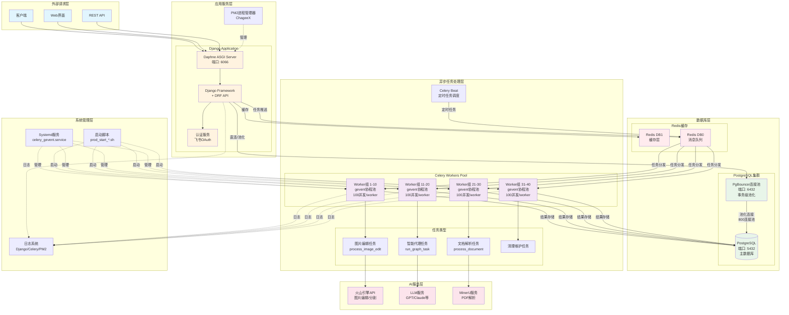
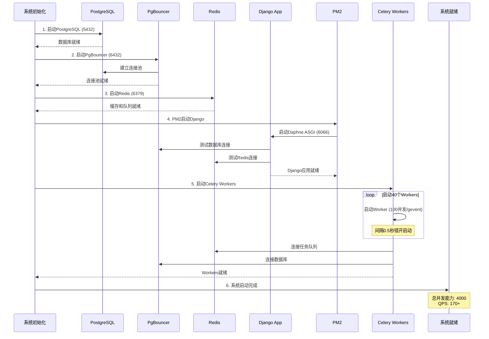
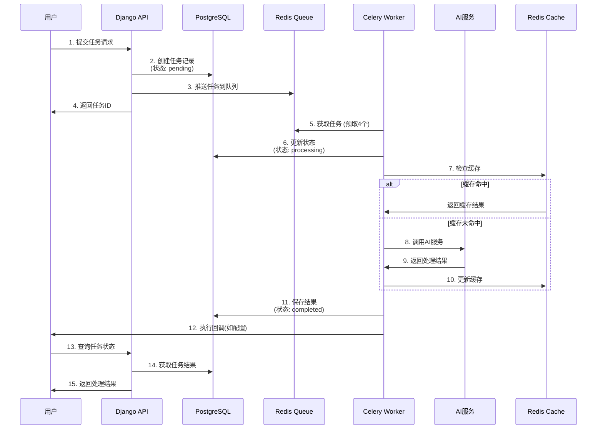

# Backend 系统架构图

## 系统启动架构和执行流程

## 系统启动顺序

## 任务执行流程

## 关键性能指标

### 并发能力
- **总并发数**: 40 workers × 100 gevent = 4000
- **QPS**: 170+ 请求/秒
- **任务处理**: 4000 并发任务

### 连接池配置
| 组件 | 配置 | 说明 |
|------|------|------|
| PgBouncer | 800连接池 | 事务级池化 |
| PostgreSQL | 1200最大连接 | 数据库上限 |
| Redis | 500连接池 | 任务队列+缓存 |
| Django | 150连接池 | 直连模式时 |

### 超时配置
| 任务类型 | 软超时 | 硬超时 | 说明 |
|----------|--------|--------|------|
| 默认任务 | 120秒 | 180秒 | 通用任务 |
| 图片处理 | 180秒 | 240秒 | AI处理耗时 |
| 文档解析 | 300秒 | 360秒 | 大文件处理 |

### 内存管理
- **Worker重启**: 每处理500个任务后重启
- **PM2内存限制**: 2GB上限，自动重启
- **预取优化**: prefetch_multiplier=4

## 故障恢复机制

1. **进程级恢复**
   - PM2自动重启Django (最多10次)
   - Systemd自动重启Celery (5秒延迟)
   - Worker子进程自动重建

2. **连接级恢复**
   - PgBouncer连接健康检查
   - Redis连接自动重连
   - TCP Keepalive保活

3. **任务级恢复**
   - 任务超时自动终止
   - 卡住任务定期检查
   - 失败任务重试机制

## 部署检查清单

- [ ] PostgreSQL服务运行在5432端口
- [ ] PgBouncer服务运行在6432端口
- [ ] Redis服务运行在6379端口
- [ ] 环境变量USE_PGBOUNCER=true
- [ ] Django应用通过PM2管理
- [ ] 40个Celery Workers已启动
- [ ] 日志目录权限正确
- [ ] 系统资源充足(16GB+ RAM)