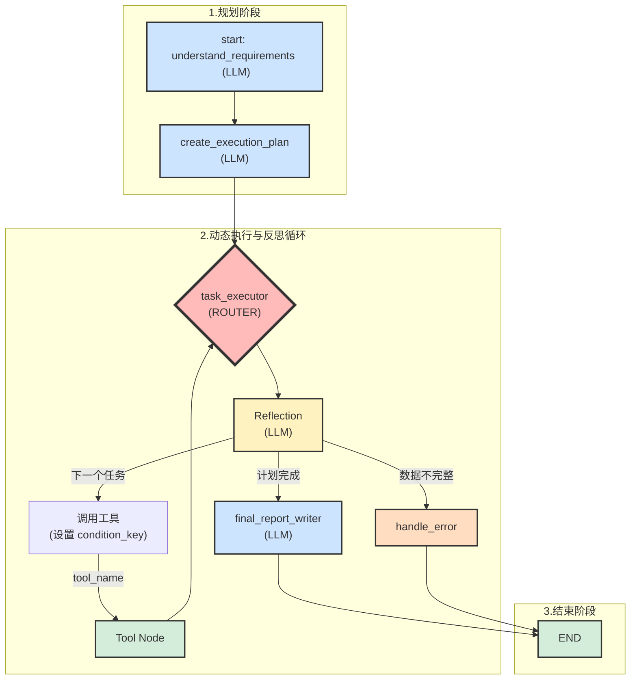

# 动态文档生成 Agent 图资源说明

本文档详细说明了通过 `create_dynamic_agent_graph.py` management command 创建的 “Dynamic Document Generation Agent” 图的结构、节点、边及其工作流程。

## 1. 概述

此 Agent 图旨在构建一个能够根据用户需求，动态规划任务、执行工具并最终生成综合报告的智能代理。

该图的创建脚本具有 **幂等性**，这意味着您可以多次运行 `python manage.py create_dynamic_agent_graph` 命令。每次运行时，脚本会首先清空旧的图结构（节点和边），然后根据最新的定义重新创建，确保图的状态始终与代码保持一致。

## 2. 图 (Graph)

- **名称 (Name)**: `Dynamic Document Generation Agent`
- **描述 (Description)**: 一个能够动态规划和执行任务的文档生成Agent。

## 3. 核心节点 (Core Nodes)

这些是构成 Agent 主要逻辑流程的静态节点。严格按照 `create_dynamic_agent_graph.py` 定义。

| 节点名称 (Name)             | 节点类型 (Type) | Python 可调用路径 (Callable)                             | 功能描述                                                                                                                                                           |
| --------------------------- | --------------- | -------------------------------------------------------- | ------------------------------------------------------------------------------------------------------------------------------------------------------------------ |
| `understand_requirements`   | `LLM`           | `tools.advanced.planner.understand_requirements`         | **需求理解 (LLM)**：作为图的入口，接收原始用户需求，利用大语言模型（LLM）进行分析和澄清，输出结构化的需求。                                                      |
| `create_execution_plan`     | `LLM`           | `tools.advanced.planner.create_execution_plan`           | **规划制定 (LLM)**：接收结构化需求，利用 LLM 生成一个详细、有序的任务执行计划。                                                                                     |
| `task_executor`             | `ROUTER`        | `tools.utils.router.task_executor`                       | **任务执行器/路由器**：图的动态核心。它根据计划调用工具，并在每次调用后，使用其内部配置的 **反思模型 (LLM)** (`reflection_model_name`) 来评估结果，决定下一步行动。 |
| `final_report_writer`       | `LLM`           | `tools.advanced.report_generator.report_generator`       | **报告生成 (LLM)**：当所有任务执行完毕后，此节点负责汇总所有结果，生成一份最终的、格式化的文档报告。                                                               |
| `handle_error`              | `TOOL`          | `tools.utils.common.handle_error`                        | **错误处理**：当 `task_executor` 反思后发现数据不完整或出现错误时，将流程导向此节点进行处理。                                                                       |
| `END`                       | `TOOL`          | `tools.utils.common.end_process`                         | **结束节点**：作为图的终点，标记整个流程的成功结束。                                                                                                                 |

## 4. 动态工具节点 (Dynamic Tool Nodes)

为了实现高度的灵活性和可扩展性，Agent 不会硬编码所有工具。相反，它会在运行时动态地发现和集成所有可用的工具。

- **发现机制**: 脚本通过 `ToolRegistry` 注册中心获取所有已注册的工具名称。
- **节点创建**: 对于每个发现的工具（排除了核心 LLM 工具后），脚本会为其创建一个 `TOOL` 类型的节点。
- **调用路径**: 所有动态工具的 `python_callable` 都指向一个统一的分发器，例如 `tools.advanced.dispatch.<tool_name>`，由分发器负责实际的函数调用。

这种设计使得在系统中添加新工具变得非常简单：只需要实现工具函数并将其注册到 `ToolRegistry` 中，Agent 图便能自动将其纳入工作流程。

## 5. 边 (Edges) 与工作流程

边定义了节点之间的有向连接，代表了数据的流动和控制流程。

### 5.1 主流程

Agent 的核心工作流是一个线性序列：

`understand_requirements` → `create_execution_plan` → `task_executor`

### 5.2 `task_executor`: 动态路由与反思循环

`task_executor` 是 Agent 的大脑，其工作流程并非固化，而是一个由 **计划驱动、反思驱动** 的动态循环。这完全依赖于 `create_dynamic_agent_graph.py` 中定义的边和 `task_executor` 节点的 `ROUTER` 类型及其 `reflection_model` 配置。

其详细工作机制如下：

1.  **接收计划**: 流程从 `create_execution_plan` 节点进入 `task_executor`，并带来一份由 LLM 生成的动态任务清单。

2.  **选择与调用**: `task_executor` 从任务清单中选择当前要执行的任务（例如，一个名为 `document_parser` 的任务）。它通过设置一个与任务/工具同名的 **条件键 (`condition_key`)**，激活通往对应工具节点的边 (`task_executor` --[`document_parser`]--> `document_parser_node`)，从而调用该工具。

3.  **工具执行**: `document_parser_node` 节点执行其具体任务。

4.  **返回与反思 (Reflection)**: 工具执行完毕后，流程通过 `document_parser_node` --> `task_executor` 的边返回。此时，`task_executor` 内部配置的 **`reflection_model` (一个 LLM)** 会被激活。它会分析：
    *   **上一步的结果**: 工具返回了什么？是否成功？
    *   **当前任务状态**: 这个任务是否完成了预定目标？
    *   **整体计划进展**: 整个任务清单的完成情况如何？

5.  **决策与再路由**: 基于反思的结果，`task_executor` 做出下一步决策，并通过设置不同的条件键来再次路由流程：
    *   **调用下一个工具**: 如果计划未完成，则重复第 2 步，选择并调用下一个工具。
    *   **宣布计划完成**: 如果所有任务都已成功完成，则设置 `plan_complete` 条件，将流程导向 `final_report_writer` 节点 (`task_executor` --[`plan_complete`]--> `final_report_writer`)。
    *   **报告错误**: 如果反思发现数据不完整或执行失败，则设置 `incomplete_data` 条件，将流程导向 `handle_error` 节点 (`task_executor` --[`incomplete_data`]--> `handle_error`)。

这个 **“调用 -> 执行 -> 返回 -> 反思 -> 决策”** 的循环，是 Agent 能够动态适应任务、处理不确定性的核心。

## 6. Agent 工作流程图 (Mermaid)

此图精确地描述了基于 `create_dynamic_agent_graph.py` 的工作流程，特别是 `task_executor` 内部的反思循环。

