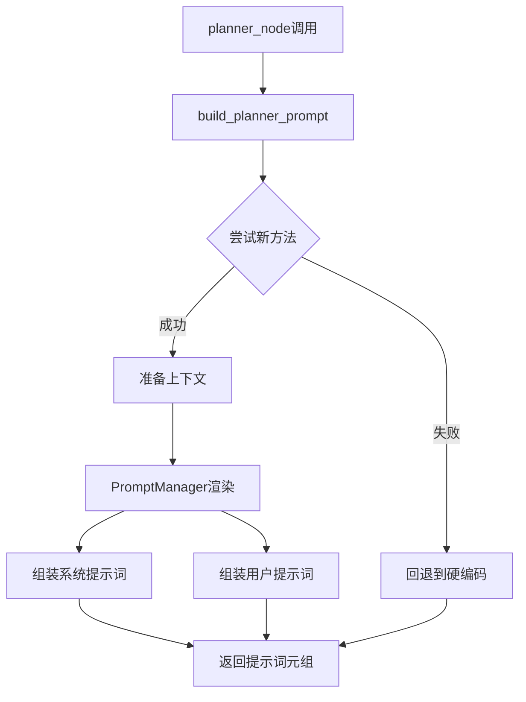

# 提示词构建流程详解

> 本文档详细说明了基于12-Factor Agents框架Factor 2改进后的提示词构建流程

## 目录
- [架构概览](#架构概览)
- [核心组件](#核心组件)
- [构建流程](#构建流程)
- [实现细节](#实现细节)
- [数据流图](#数据流图)
- [最佳实践](#最佳实践)

## 架构概览

### 改进前后对比

| 维度 | 改进前 | 改进后 |
|------|--------|--------|
| 存储方式 | Python代码硬编码 | YAML配置文件 |
| 文件大小 | 单文件456行 | 4个YAML + 380行代码 |
| 可维护性 | 需要修改代码 | 直接编辑YAML |
| 版本控制 | 与代码混合 | 独立版本管理 |
| 热更新 | 需要重启服务 | 支持热更新 |
| A/B测试 | 不支持 | 原生支持 |

### 文件结构
```
backend/agentic/
├── prompts/                          # 提示词根目录
│   ├── config.yaml                   # 配置文件
│   └── templates/                    # 模板目录
│       └── planner/                  # planner节点模板
│           ├── core.yaml             # 核心身份定义
│           ├── framework.yaml        # 思考框架
│           ├── guides.yaml           # 决策指南
│           └── formats.yaml          # 输出格式
├── prompt_manager.py                 # 提示词管理器
└── context_builders/
    └── prompt_builder.py             # 提示词构建器
```

## 核心组件

### 1. PromptManager（提示词管理器）

**职责**：
- 加载和缓存YAML模板
- 提供模板渲染功能
- 支持热更新和版本管理
- 处理Jinja2模板语法

**关键特性**：
```python
class PromptManager:
    """单例模式的提示词管理器"""
    
    def __init__(self):
        self.templates = {}          # 模板缓存
        self.jinja_env = Environment()  # Jinja2环境
        self._load_all_templates()   # 初始化加载
    
    def render_prompt(self, template_type, context, section=None):
        """渲染特定模板"""
        pass
    
    def build_planner_prompt(self, context):
        """构建完整的planner提示词"""
        pass
```

### 2. YAML模板结构

每个YAML文件定义了提示词的一个逻辑部分：

```yaml
# core.yaml - 身份和能力定义
identity:
  title: "智能任务规划器"
  description: |
    你负责理解用户需求并规划执行步骤。

capabilities:
  - name: "理解"
    description: "分析需求本质"
  - name: "规划"
    description: "分解为可执行步骤"
```

### 3. 上下文准备器

负责收集运行时数据：

```python
def _prepare_render_context(state: RuntimeState) -> Dict:
    """准备渲染上下文"""
    return {
        'task_goal': state._original_task_goal,
        'capability_map': get_dynamic_capability_map(state),
        'tool_descriptions': get_dynamic_tool_description(),
        'history_summary': build_concise_history(state.action_summaries),
        'todo_section': _build_todo_section(state),
        # ... 更多动态数据
    }
```

## 构建流程

### 第一阶段：系统初始化


**代码流程**：
```python
# 1. 系统启动时自动执行
prompt_manager = PromptManager()

# 2. 扫描并加载模板
for yaml_file in templates_dir.glob("**/*.yaml"):
    template_key = f"{type}_{name}"  # 如: planner_core
    content = yaml.safe_load(yaml_file)
    templates[template_key] = PromptTemplate(
        name=template_key,
        content=content,
        last_modified=file_stat.st_mtime
    )
```

### 第二阶段：运行时构建



**详细步骤**：

#### Step 1: 触发构建
```python
# graph_nodes.py - planner节点
def planner_node(state: RuntimeState):
    # 调用构建函数
    system_prompt, user_prompt = build_planner_prompt(state, nodes_map)
```

#### Step 2: 准备上下文数据
```python
context = {
    # 静态配置
    'identity_title': '智能任务规划器',
    
    # 动态状态
    'task_goal': state._original_task_goal,
    'history_summary': build_concise_history(state.action_summaries),
    
    # 工具信息
    'capability_map': get_dynamic_capability_map(state),
    'tool_descriptions': get_dynamic_tool_description(),
    
    # TODO管理
    'todo_section': _build_todo_section(state),
    'task_guidance': _build_task_guidance(state),
    
    # 数据摘要
    'data_summary': get_data_catalog_summary(state)
}
```

#### Step 3: 渲染YAML模板
```python
def build_planner_prompt(self, context):
    # 分别渲染各个部分
    sections = {}
    for section in ['core', 'framework', 'guides', 'formats']:
        template_data = self.get_template_data('planner', section)
        sections[section] = self._render_template_data(template_data, context)
    
    return self._assemble_prompts(sections, context)
```

#### Step 4: 递归渲染模板数据
```python
def _render_template_data(self, template_data, context):
    if isinstance(template_data, dict):
        rendered_parts = []
        for key, value in template_data.items():
            if key == 'title':
                rendered_parts.append(f"## {value}")
            elif key == 'description':
                rendered_parts.append(value)
            elif isinstance(value, dict):
                # 递归渲染嵌套结构
                rendered_parts.append(self._render_template_data(value, context))
            elif isinstance(value, list):
                # 渲染列表项
                rendered_parts.append(self._render_list(value, context))
            elif isinstance(value, str):
                # Jinja2模板渲染
                template = Template(value)
                rendered_parts.append(template.render(**context))
        
        return "\n\n".join(filter(None, rendered_parts))
```

#### Step 5: 组装最终提示词
```python
def _assemble_prompts(self, sections, context):
    # 系统提示词组装
    system_parts = [
        f"# {context['identity_title']}",
        sections['core'],           # 身份和能力
        sections['framework'],       # 思考框架
        f"## 可用能力\n{context['capability_map']}",
        f"## 工具详细参数\n{context['tool_descriptions']}",
        sections['guides'],          # 决策指南
        sections['formats']          # 输出格式
    ]
    
    # 用户提示词组装
    user_parts = [
        "## 当前状态信息",
        f"### 原始任务\n{context['task_goal']}",
        context.get('todo_section', ''),
        f"### 执行进展概览\n{context['history_summary']}",
        context.get('detailed_history', ''),
        context.get('data_summary', ''),
        "请基于以上信息和你的能力，决定下一步最合适的行动。"
    ]
    
    return ("\n".join(system_parts), "\n".join(user_parts))
```

### 第三阶段：错误处理与回退

```python
def build_planner_prompt(state, nodes_map):
    try:
        # 尝试使用新的PromptManager
        prompt_manager = get_prompt_manager()
        context = _prepare_render_context(state, nodes_map)
        return prompt_manager.build_planner_prompt(context)
        
    except Exception as e:
        logger.error(f"PromptManager失败: {e}")
        # 回退到简化的硬编码版本
        return _build_planner_prompt_fallback(state, nodes_map)
```

## 实现细节

### 热更新机制

```python
def _check_hot_reload(self):
    """检查并重新加载修改过的模板"""
    if not self.config.get('hot_reload', {}).get('enabled'):
        return
    
    now = time.time()
    interval = self.config.get('hot_reload', {}).get('watch_interval', 5)
    
    if now - self.last_check_time < interval:
        return  # 避免频繁检查
    
    self.last_check_time = now
    
    # 重新加载有变化的模板
    for template_file in self.templates_dir.glob("**/*.yaml"):
        stat = template_file.stat()
        template_key = self._get_template_key(template_file)
        
        if template_key in self.templates:
            if self.templates[template_key].last_modified < stat.st_mtime:
                self._load_single_template(template_key, template_file)
                logger.info(f"热更新模板: {template_key}")
```

### 缓存策略

```python
class PromptTemplate:
    """模板缓存对象"""
    name: str
    content: Dict
    version: str = "1.0"
    last_modified: float
    checksum: str  # MD5校验和，用于快速比较
```

### 性能优化

1. **单例模式**：避免重复初始化
2. **文件缓存**：减少IO操作
3. **增量更新**：只重新加载变化的文件
4. **延迟加载**：按需加载特定模板

## 数据流图

### 完整数据流

```
┌─────────────┐     ┌──────────────┐     ┌───────────────┐
│  YAML模板   │────▶│PromptManager │────▶│ 渲染后的提示词 │
└─────────────┘     └──────────────┘     └───────────────┘
                            ▲
                            │
                    ┌───────┴────────┐
                    │  运行时上下文   │
                    └────────────────┘
                            ▲
        ┌───────────────────┼───────────────────┐
        │                   │                   │
┌───────▼──────┐   ┌────────▼──────┐   ┌───────▼──────┐
│RuntimeState  │   │ToolRegistry   │   │HistoryData   │
└──────────────┘   └───────────────┘   └──────────────┘
```

### 模板渲染流程

```
YAML数据结构 ──▶ Python字典 ──▶ 递归渲染 ──▶ 格式化文本
     │              │              │            │
     │              │              │            │
  core.yaml    template_data   _render()   "## 智能任务..."
```

## 最佳实践

### 1. 模板设计原则

**DO ✅**：
- 使用语义化的键名（如`identity`而非`id`）
- 将相关内容组织在同一文件中
- 使用YAML的多行字符串语法保持格式
- 为每个模板添加注释说明用途

**DON'T ❌**：
- 在YAML中包含业务逻辑
- 创建过深的嵌套结构（最多3层）
- 在模板中硬编码动态数据
- 混合不同语言的内容

### 2. 版本管理策略

```yaml
# config.yaml
ab_testing:
  enabled: true
  experiments:
    - name: "planner_v2"
      percentage: 20  # 20%流量使用新版本
      template: "versions/planner_v2.yaml"
```

### 3. 调试技巧

```python
# 启用详细日志
logger.debug(f"渲染模板: {template_key}")
logger.debug(f"上下文数据: {context}")
logger.debug(f"渲染结果长度: {len(rendered_text)}")

# 模板验证
def validate_template(template_data):
    required_fields = ['identity', 'capabilities']
    for field in required_fields:
        assert field in template_data, f"缺少必需字段: {field}"
```

### 4. 性能监控

```python
import time

def render_with_metrics(self, template_type, context):
    start_time = time.time()
    result = self.render_prompt(template_type, context)
    elapsed = time.time() - start_time
    
    # 记录性能指标
    logger.info(f"模板渲染耗时: {elapsed:.2f}秒")
    
    if elapsed > 0.5:  # 超过500ms警告
        logger.warning(f"模板渲染缓慢: {template_type}")
    
    return result
```

## 扩展性设计

### 支持新节点类型

只需创建新的模板目录：
```
templates/
├── planner/      # 已实现
├── reflection/   # 待实现
├── finalizer/    # 待实现
└── custom/       # 自定义节点
```

### 支持多语言

```yaml
# templates/planner/core_zh.yaml - 中文版本
# templates/planner/core_en.yaml - 英文版本

identity:
  title: "{{ i18n.get('task_planner', lang) }}"
```

### 支持主题切换

```python
def apply_theme(self, theme_name: str):
    """应用不同的提示词主题"""
    theme_config = self.load_theme(theme_name)
    self.update_templates(theme_config)
```

## 故障排除

### 常见问题

1. **模板找不到**
   - 检查文件路径是否正确
   - 确认YAML文件格式正确
   - 查看日志中的加载错误

2. **渲染结果为空**
   - 验证上下文数据完整性
   - 检查模板语法错误
   - 启用调试日志查看详情

3. **性能下降**
   - 检查缓存是否生效
   - 避免频繁的热更新检查
   - 优化模板复杂度

### 回退机制

当新系统失败时，自动使用简化版硬编码提示词：
```python
def _build_planner_prompt_fallback(state, nodes_map):
    """最小化的硬编码提示词，确保系统可用"""
    return (
        "# 智能任务规划器\n你负责理解用户需求并规划执行步骤。",
        f"任务: {state._original_task_goal}\n请决定下一步行动。"
    )
```

## 总结

新的提示词构建流程实现了：

1. **完全的外部化配置**：提示词与代码分离
2. **灵活的模板系统**：支持复杂的组合和渲染
3. **健壮的错误处理**：多级回退保证可用性
4. **优秀的可维护性**：非技术人员也能修改
5. **面向未来的扩展性**：轻松支持新功能

这完全符合12-Factor Agents框架的Factor 2原则：**掌控你的提示词**。提示词不再是黑盒，而是透明、可控、可测试的一流代码资产。

---

*最后更新：2025-09-08*  
*相关文档：[12-Factor Agents框架](./12-Factor-Agents-Dex-Horthy-CN.md) | [Factor 2实施记录](../../work_logs/)*