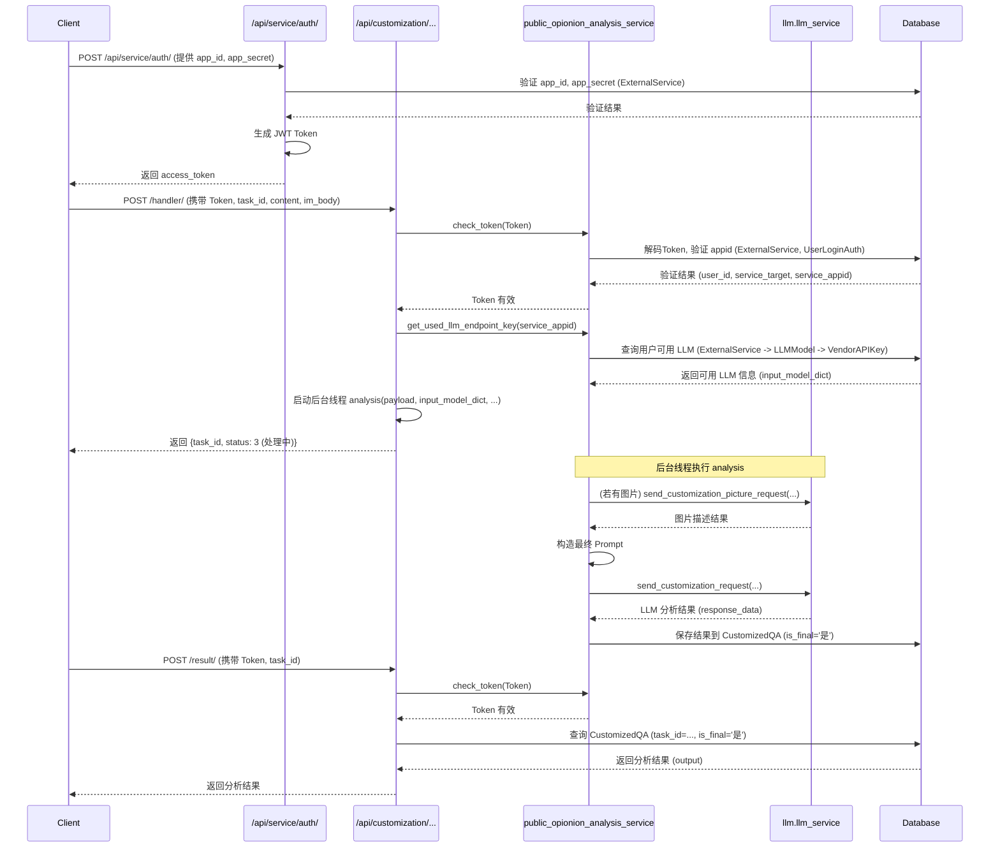

# Customization (定制化 - 舆情分析) 模块

## 1. 概述

本模块 (`customization`) 提供了舆情分析的核心功能。它接收用户通过 API 提交的文本和图片内容，利用后台配置的大语言模型 (LLM) 进行分析，并将分析结果存储到数据库中。用户可以通过任务 ID 查询分析结果。

该模块依赖 `service_api` 模块进行身份验证。客户端需要先通过 `/api/service/auth/` 接口，使用 `app_id` 和 `app_secret` 获取 JWT `access_token`，然后在调用本模块的 API 时，在 `Authorization` 请求头中携带此 `token`。

## 2. 核心功能

-   **舆情分析任务提交**: 接收包含文本和图片链接的请求，启动后台异步分析任务。
-   **舆情分析结果查询**: 根据任务 ID 查询分析任务的最终结果。
-   **批量处理**: 支持批量提交分析任务和批量查询结果。
-   **多模态分析**: 能够处理文本内容，并通过调用视觉模型处理图片内容，综合进行分析。
-   **身份验证**: 通过验证请求头中的 JWT `access_token` 来确保请求的合法性。

## 3. 工作流程与鉴权

以下序列图展示了从获取 Token 到提交分析任务、最终查询结果的完整流程：

**鉴权说明**:

1.  客户端首先需要调用 `/api/service/auth/` 接口，使用分配的 `app_id` 和 `app_secret` 进行身份验证，获取一个有时效性的 `access_token`。
2.  在调用 `customization` 模块的 API (如 `/handler/`, `/result/`) 时，客户端必须在 HTTP 请求的 `Authorization` Header 中包含 `Bearer <access_token>`。
3.  `customization` 模块的视图函数会调用 `public_opionion_analysis_service.check_token` 函数来验证 `token` 的有效性（包括是否过期、签名是否正确、签发者 `appid` 是否存在于 `ExternalService` 且对应用户审核状态是否通过等）。
4.  只有 `token` 验证通过后，后续的业务逻辑才会执行。

## 4. API 端点

本模块主要提供以下 API 接口 (详情请参考 `customization/文档.md`):

-   `POST /api/customization/public_sentiment/handler/`: 提交单个舆情分析任务。
-   `POST /api/customization/public_sentiment/batch_handler/`: 批量提交舆情分析任务。
-   `POST /api/customization/public_sentiment/result/`: 查询单个舆情分析任务的结果。
-   `POST /api/customization/public_sentiment/batch_result/`: 批量查询舆情分析任务的结果。
