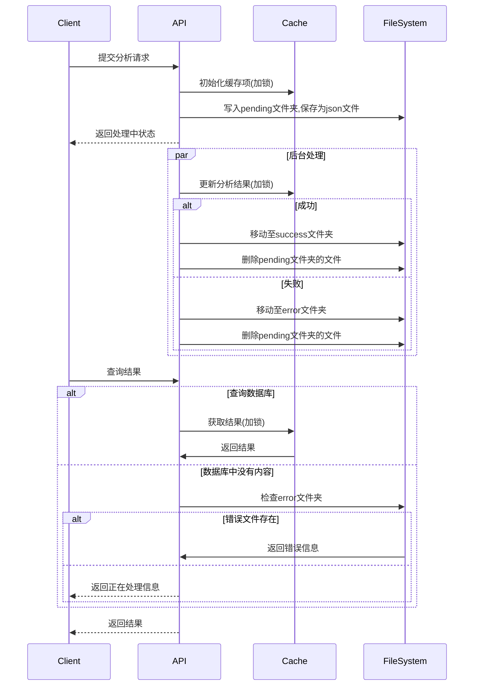

# 缓存机制设计文档

## 设计目的
1. 提高舆情分析服务的响应速度
2. 减少数据库查询压力
3. 保证多线程环境下的数据一致性

## 数据结构
```python
task_input_cache = {
    "task_content": {
            "task_id": str,
            "content": str,
            "im_body": list,
            "process": dict(),
            "output": {
                "images_statuss": list,
                "content_status": str
            }
     },  # 任务内容
    "output": dict,  # 分析结果
    "error_reason": str  # 错误原因
    }
```

## 使用流程
1. **写入流程**
   - 在`public_sentiment_analysis_service`接口中初始化缓存项并加入缓存数组
   - 后台线程完成分析后，无论成功或是失败，都从缓存数组删除
   - 使用`task_input_cache_lock`保证线程安全
   - 当线程开始分析后， 将文件内容写入到pending文件夹中
   - 当分析成功后，将文件内容从pending文件夹中转移到success文件夹中
   - 当分析失败后，将文件内容从pending文件夹中转移到error文件夹中

2. **读取流程**
   - 在`public_sentiment_result_service`接口中查询数据库的内容
   - 如果找到则返回正确结果
   - 如果没有找到，则去error文件夹中查找，如果能找对应的文件(task_id)到则返回失败(对方不用再次读取了)； 如果没有找到，则返回正在处理(对方可以再次读取)

## 注意事项
1. 缓存仅作为临时存储，最终结果仍需持久化到数据库
2. 每个任务ID在缓存中只保留一份记录
3. 使用锁机制保证多线程安全
4. 缓存无自动过期机制，需手动清理
5. 建立success文件夹，pending文件夹，error文件夹来作为状态记录

## 流程图

