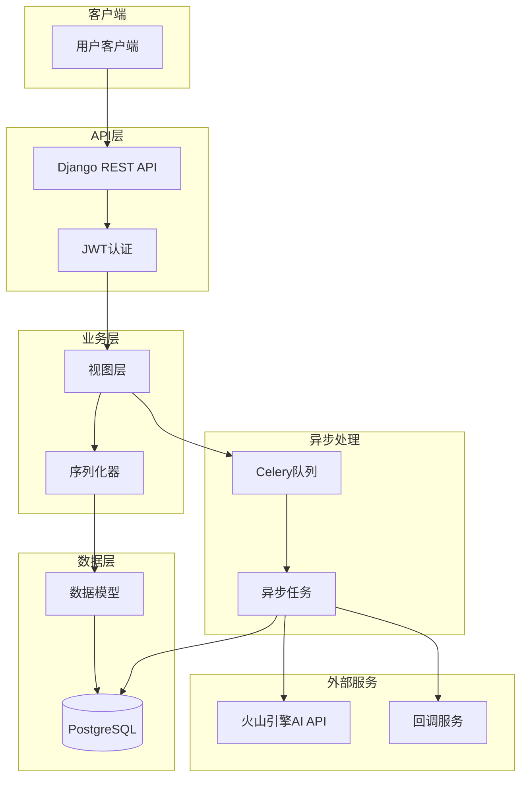
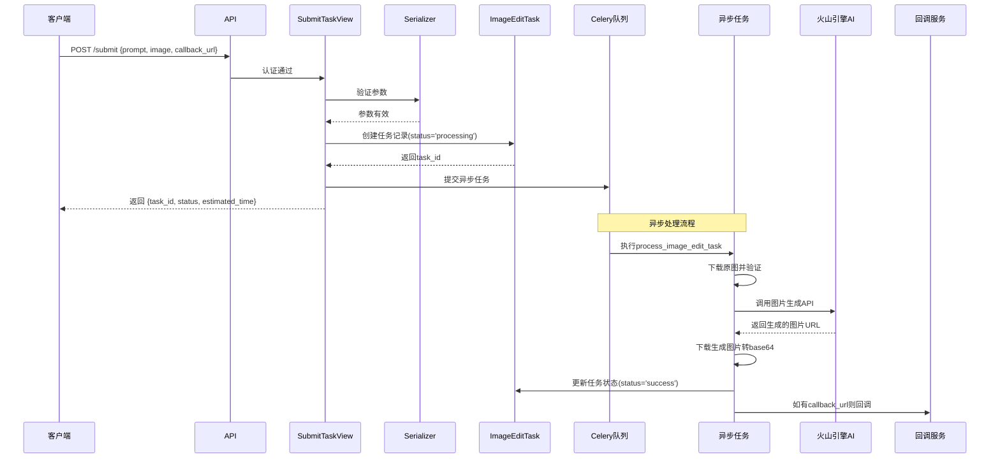
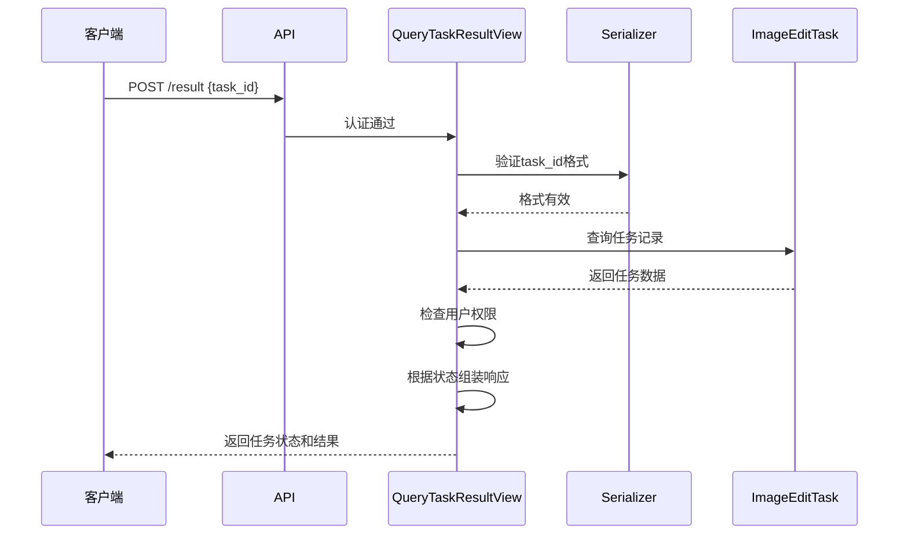
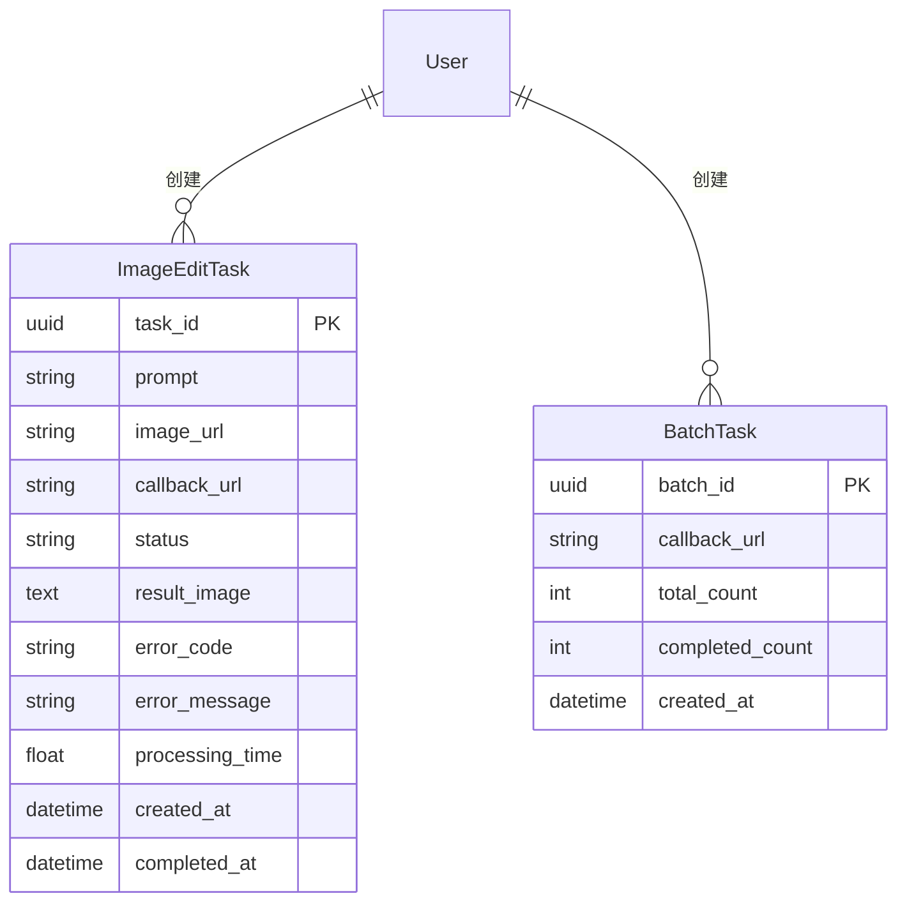
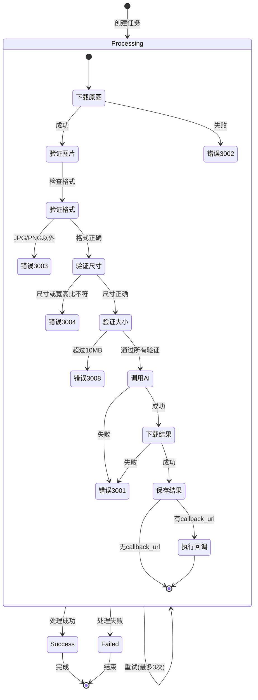
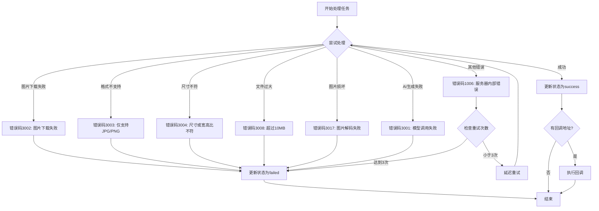
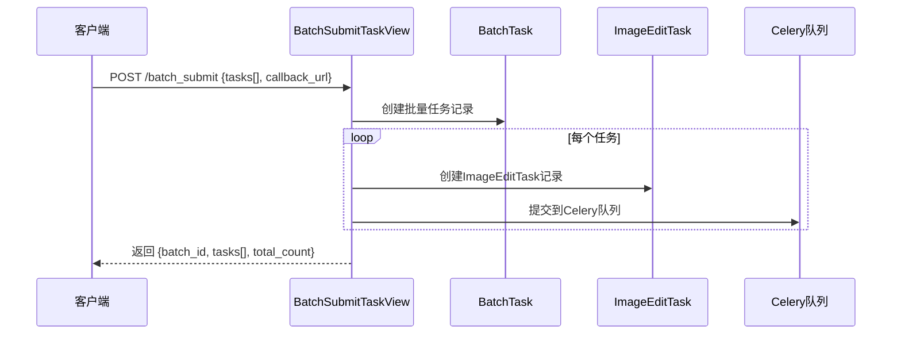

# Image Editor 业务流程图

**更新时间**: 2025-08-06
**状态**: 已根据最新代码实现更新

## 一、整体架构图

## 二、单任务提交流程

## 三、任务查询流程

## 四、数据模型关系

## 五、任务状态流转图

## 六、错误处理流程

## 七、API接口总览

| 接口路径 | 方法 | 功能 | 认证要求 |
|---------|------|------|---------|
| `/submit/` | POST | 提交单个任务 | 需要认证 |
| `/result/` | POST | 查询单个任务结果 | 需要认证 |
| `/batch_submit/` | POST | 批量提交任务 | 需要认证 |
| `/batch_result/` | POST | 批量查询结果 | 需要认证 |
| `/status/` | GET | API状态查询 | 无需认证 |

## 八、批量任务流程（已实现）

## 九、已解决的问题

### 1. ✅ 批量功能已实现
- `BatchSubmitTaskView` 已实现批量任务创建逻辑
- `BatchTask` 模型已被使用，记录批量任务信息
- `BatchQueryTaskResultView` 已实现批量查询功能

### 2. ✅ 错误码体系已统一
- API层错误码已按文档规范使用：
  - 1002: 权限不足
  - 1003: 请求参数无效
  - 1004: 任务不存在
  - 1006: 服务器内部错误
- 业务层错误码已按文档规范使用：
  - 3001: 模型调用失败
  - 3002: 图片下载失败
  - 3003: 图片格式不支持
  - 3004: 图片尺寸不符合要求
  - 3008: 图片文件过大
  - 3017: 图片解码失败

### 3. ✅ 图片验证功能已实现
- 图片格式验证：仅支持 JPG、PNG（符合API文档）
- 图片尺寸验证：宽高必须大于 14 像素
- 宽高比验证：必须在 (1/3, 3) 范围内
- 文件大小验证：不超过 10MB
- 已添加 Pillow 依赖用于图片验证

### 4. 字段命名说明
- API参数：`image` - 符合API文档规范
- 数据库字段：`image_url` - 内部存储使用
- 返回结果：`result_image` - 区分原图和结果图
- 命名符合各层职责，无需修改

## 十、当前系统特性

1. **完整的错误处理**：根据不同的失败原因返回对应的错误码
2. **图片验证**：在下载后立即验证，避免无效图片进入AI处理
3. **批量处理**：支持批量提交和查询，提高处理效率
4. **异步处理**：使用 Celery 实现异步任务处理
5. **回调机制**：支持任务完成后的回调通知
6. **权限控制**：用户只能查询自己的任务