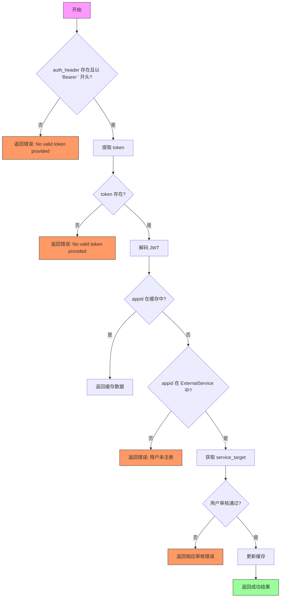

# _check_token 函数处理流程文档

## 函数概述
`_check_token` 函数用于验证 JWT token 的有效性，并返回相关用户信息。主要功能包括：
- 验证 token 格式
- 解码 JWT token
- 检查缓存
- 验证服务注册状态
- 验证用户审核状态
- 更新缓存

## 输入输出
### 输入参数
- `auth_header`: 包含 Bearer token 的授权头字符串

### 返回值
返回一个元组，包含四个元素：
1. 检查结果字符串 ("success" 或错误信息)
2. 用户 ID (成功时返回有效 ID，失败返回 -1)
3. 服务目标 (service_target)
4. 服务应用 ID (service_appid)

## 详细处理流程

### 1. 初始验证
- 检查 auth_header 是否存在且以 'Bearer ' 开头
- 如果验证失败，返回错误信息 "error: No valid token provided"

### 2. Token 处理
- 从 auth_header 中提取 token (去除 'Bearer ' 前缀)
- 如果 token 存在，尝试解码 JWT

### 3. 缓存检查
- 检查 decoded_data['appid'] 是否在 service_cache 中
- 如果在缓存中，直接返回缓存中的用户信息

### 4. 服务验证
- 检查 appid 是否在 ExternalService 中注册
- 如果未注册，返回错误信息 "error: 这个用户没有注册"

### 5. 用户审核验证
- 检查 UserLoginAuth 记录
- 如果审核未通过或没有审核记录，返回相应错误信息

### 6. 缓存更新
- 将验证通过的用户信息存入 service_cache
- 缓存结构包含：
  - user_id
  - service_target
  - service_appid
  - llm_models (空字典)

### 7. 错误处理
捕获并处理以下异常：
- jwt.ExpiredSignatureError: token 过期
- jwt.InvalidTokenError: 无效 token
- 其他异常: 返回具体错误信息

## 流程图

## 错误处理说明
函数可能返回的错误信息包括：
1. "error: No valid token provided" - token 格式错误或不存在
2. "error: 这个用户没有注册" - appid 未在 ExternalService 中注册
3. "error: 这个用户没有通过审核" - 用户审核未通过
4. "error: 没有发现这个用户有过申请审核记录" - 无审核记录
5. "error: Token has expired" - token 已过期
6. "error: Invalid token" - 无效 token
7. "error: Unexpected error decoding token: {str(e)}" - 其他解码异常

## 缓存机制
- 使用全局 service_cache 字典存储已验证的用户信息
- 缓存键为 service_appid
- 缓存值包含:
  - user_id
  - service_target
  - service_appid
  - llm_models (初始为空字典)
- 缓存更新时机: 当用户首次验证通过时