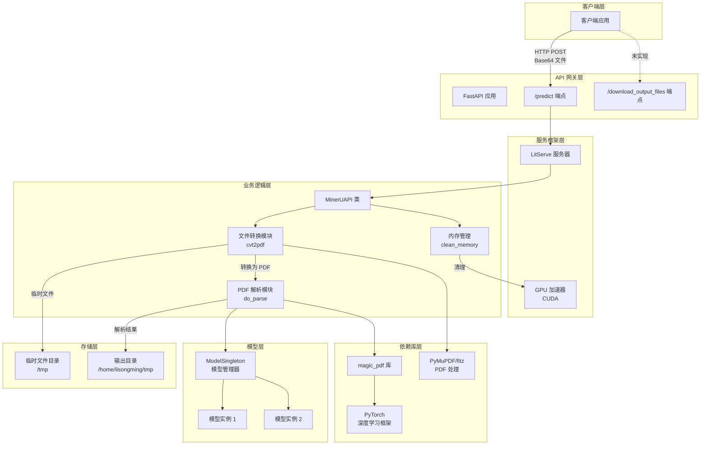
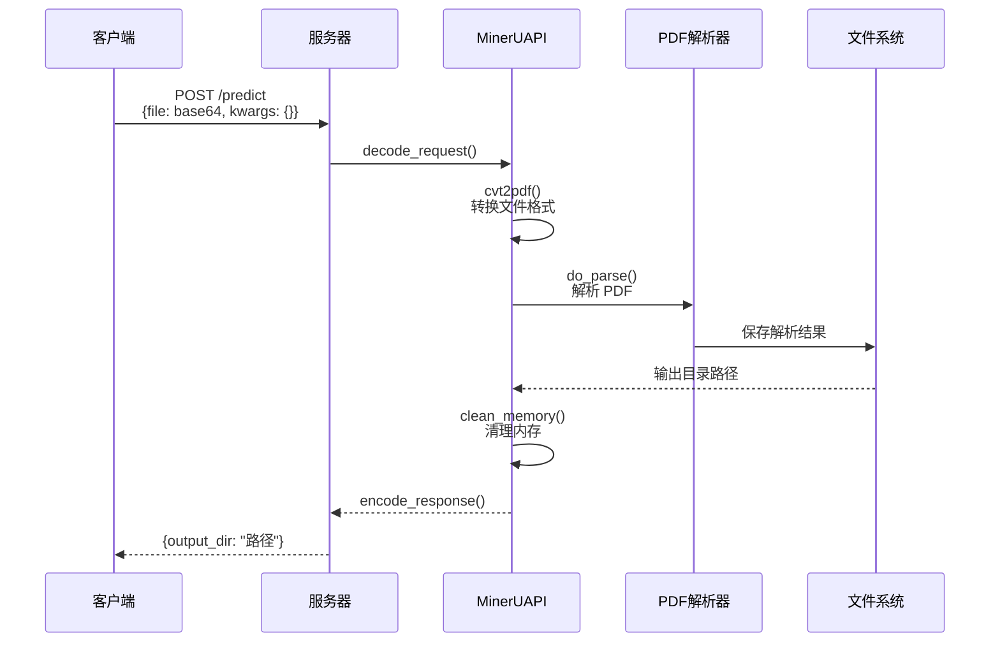

# MinerU-API 服务器架构

## 系统架构图



## 组件说明

### 1. API 层
- **FastAPI**: 提供 RESTful API 接口
- **端点**:
  - `/predict`: 接收 Base64 编码的文件，返回解析结果目录
  - `/download_output_files`: 下载输出文件（未完整实现）

### 2. 服务框架
- **LitServe**: 高性能服务框架
  - 支持 GPU 加速（CUDA）
  - 自动设备分配
  - 批处理支持（最大 32）
  - 超时控制（请求 120s，批处理 60s）

### 3. 核心处理流程



### 4. 文件格式支持
- **直接支持**: PDF
- **图片转换**: JPG, PNG → PDF
- **文档转换**: DOC, DOCX, PPT, PPTX → PDF

### 5. 性能优化
- **GPU 加速**: 使用 CUDA 进行模型推理
- **内存管理**: 
  - 自动清理 CUDA 缓存
  - 垃圾回收机制
  - 临时文件自动清理
- **批处理**: 支持最多 32 个请求批处理

### 6. 错误处理
- HTTP 异常处理
- 文件格式验证
- 临时目录清理保证
- 解析失败时的目录清理

## 部署配置
```python
# 服务器配置
- 端口: 8002
- GPU: 自动分配
- 每设备工作进程: 1
- 超时: 禁用全局超时
- 输出目录: /home/lisongming/tmp
```