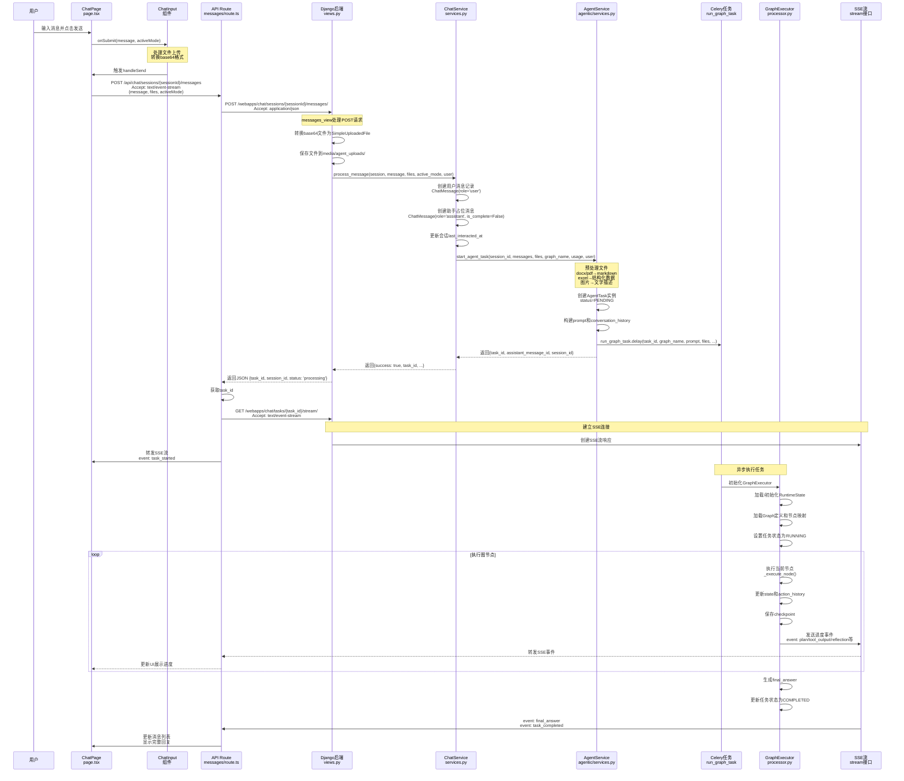
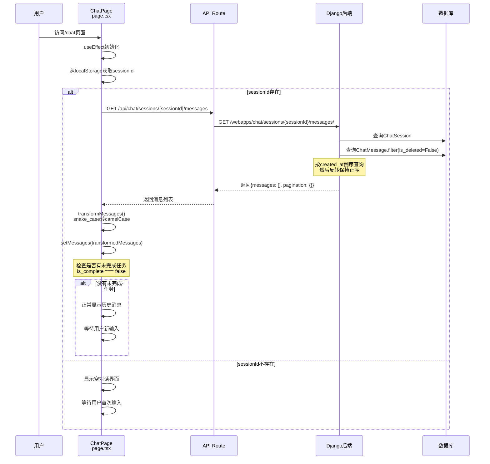
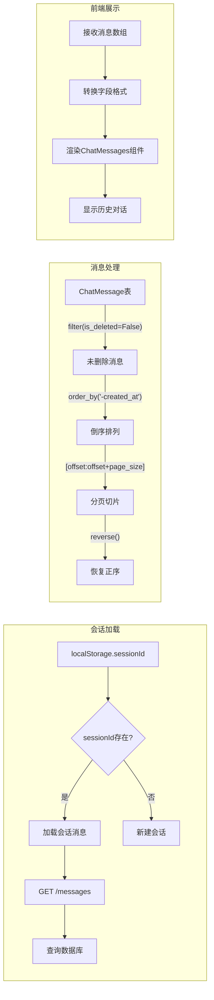
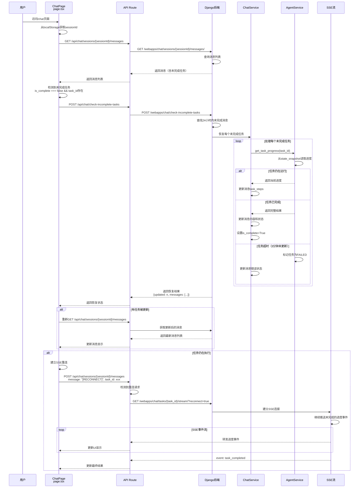
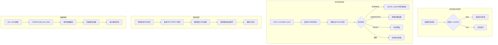

# 前端对话界面到agentic图运行的全流程图

## 相关业务
web/src/app/chat/page.tsx
web/src/components/ui/ChatInput.tsx
web/src/components/ui/ChatMessages.tsx
web/src/app/api/chat/sessions/route.ts
web/src/app/api/chat/sessions/[sessionId]/messages/route.ts
backend/webapps/chat/views.py
backend/agentic/

## 目的
描述chat的业务流程和数据流转

## 规范
- mermaid 流程
- 数据流转UML图，精确到字段，每个节点是一个关键的数据处理环节的对应函数

## 画流程图

### 发起一个新消息



#### 数据流转详情

```mermaid
graph TB
    subgraph 前端数据结构
        A1[用户输入] -->|"{ message: string, activeMode: string }"| A2[ChatInput组件]
        A2 -->|"files: FileRecord[]"| A3[文件处理]
        A3 -->|"base64编码"| A4[API请求体]
        
        A4 -->|"{ 
            message: string, 
            activeMode: string,
            files: [{
                name: string,
                type: string,
                size: number,
                data: base64
            }]
        }"| A5[POST请求]
    end
    
    subgraph 后端数据转换
        B1[messages_view] -->|"convert_base64_to_files()"| B2[SimpleUploadedFile对象]
        B2 -->|"保存到本地"| B3[文件路径信息]
        B3 -->|"{ 
            path: string,
            name: string,
            size: number,
            type: string
        }"| B4[ChatService]
    end
    
    subgraph Agent处理
        C1[AgentService] -->|"_preprocess_files()"| C2[结构化数据]
        C2 -->|"{ 
            documents: {}, 
            tables: {},
            images: {},
            other_files: []
        }"| C3[RuntimeState]
        
        C3 -->|"{ 
            task_goal: string,
            preprocessed_files: dict,
            origin_images: list,
            conversation_history: list,
            user_context: dict
        }"| C4[GraphExecutor]
    end
    
    subgraph 执行状态
        D1[GraphExecutor] -->|"action_history"| D2[ActionSteps]
        D2 -->|"{ 
            type: string,
            content: dict,
            timestamp: datetime
        }"| D3[state_snapshot]
        
        D3 -->|"SSE事件"| D4[前端更新]
    end
```



### 打开一个已有会话（所有对话已完成）



#### 数据加载流程



### 打开一个已有会话（最后一次对话未完成）



#### 任务恢复机制



## 关键数据结构说明

### 前端Message接口
```typescript
interface Message {
  id: string;
  role: 'user' | 'assistant' | 'system';
  content: string;
  timestamp?: string;
  task_id?: string;
  is_complete?: boolean;
  taskSteps?: TaskStep[];
  finalWebSearchResults?: any[];
}
```

### 后端ChatMessage模型
```python
class ChatMessage(models.Model):
    session = ForeignKey(ChatSession)
    role = CharField()  # 'user', 'assistant', 'system'
    content = TextField()
    task_id = CharField(null=True)
    is_complete = BooleanField(default=True)
    task_steps = JSONField(null=True)
    files_info = JSONField(null=True)
    is_deleted = BooleanField(default=False)
```

### AgentTask模型
```python
class AgentTask(models.Model):
    task_id = UUIDField(primary_key=True)
    graph = ForeignKey(Graph)
    status = CharField()  # PENDING, RUNNING, COMPLETED, FAILED
    state_snapshot = JSONField()
    session_task_history = JSONField()  # 会话历史任务ID列表
```

### RuntimeState结构
```python
class RuntimeState:
    """
    表示智能体图的全局运行时状态。
    维护了智能体在执行任务过程中的所有关键信息。
    """
    def __init__(self, 
                 task_goal: str,                              # 任务目标（包含usage的完整描述）
                 preprocessed_files: Optional[Dict[str, Any]], # 预处理后的文件数据
                 origin_images: Optional[List[str]],          # 原始图片（base64格式）
                 usage: Optional[str],                        # 任务类型标签
                 action_history: Optional[List[Dict[str, Any]]], # 行动历史
                 context_memory: Optional[Dict[str, Any]],    # 会话级上下文记忆
                 user_context: Optional[Dict[str, Any]],      # 用户上下文（ID、角色、权限等）
                 chat_history: Optional[List[Dict[str, str]]]): # 历史对话（OpenAI格式）
        
        # 实际存储的字段
        self.task_goal: str  # 组合了usage和原始task_goal的完整描述
        self.preprocessed_files: Dict[str, Any] = {
            'documents': {},    # markdown格式的文档内容
            'tables': {},       # 表格数据结构
            'images': {},       # 图片的文字描述
            'other_files': {}   # 其他类型文件
        }
        self.origin_images: List[str]  # base64格式的原始图片
        self.action_history: List[Dict[str, Any]]  # 包含'type'和'data'的字典列表
        self.context_memory: Dict[str, Any]  # 跨任务保持的重要信息
        self.user_context: Dict[str, Any]  # 用户相关信息
```

### ActionSteps结构（action_history中的元素）
```python
# action_history中的每个元素结构
{
    'type': str,  # 动作类型：'plan', 'tool_output', 'reflection', 'final_answer'等
    'data': {
        # PlannerOutput场景
        'thought': str,           # 规划器的推理过程
        'action': str,            # 'CALL_TOOL' 或 'FINISH'
        'tool_name': str,         # 工具名称
        'tool_input': Dict,       # 工具输入参数
        'expected_outcome': str,  # 期望结果
        
        # ToolOutput场景
        'status': str,            # 'success', 'failed', 'partial'
        'message': str,           # 执行情况描述
        'primary_result': Any,    # 主要结果
        'key_metrics': Dict,      # 关键指标
        
        # Reflection场景
        'conclusion': str,        # 结果总结
        'is_finished': bool,      # 是否正常完成
        'is_sufficient': bool,    # 结果是否充分
        
        # FinalAnswer场景
        'answer': str,            # 最终回答内容
        'title': str,             # 会话标题
    },
    'timestamp': str,  # ISO格式时间戳
    'action_id': str,  # 唯一标识符，格式为 'action_{timestamp}'
}
```