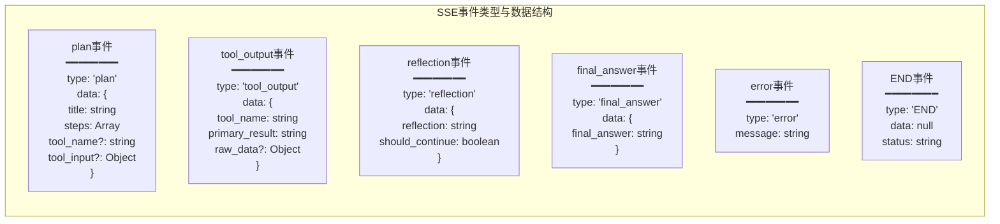
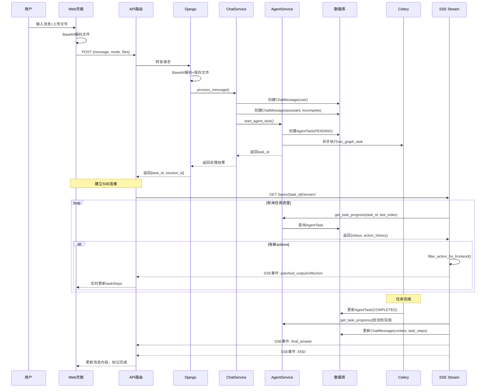

# Web页面到Agent数据的字段映射关系图 (Flowchart版)

## 完整数据流转的字段级映射

```mermaid
flowchart LR
    %% ==================== 第1层: Web页面 ====================
    subgraph Web["🌐 Web页面 (page.tsx)"]
        direction LR
        W_message[message: string]
        W_activeMode[activeMode: string]
        W_uploadedFiles[uploadedFiles: Array]
        W_file_name[name: string]
        W_file_type[type: string]
        W_file_size[size: number]
        W_file_data[data: base64]
    end

    %% ==================== 第2层: API路由 ====================
    subgraph API["📡 API路由 (route.ts)"]
        direction LR
        A_message[message: string]
        A_mode[mode: string]
        A_files[files: Array]
        A_file_name[name: string]
        A_file_type[type: string]
        A_file_size[size: number]
        A_file_data[data: base64]
        A_sessionId[sessionId: UUID]
    end

    %% ==================== 第3层: Django视图 ====================
    subgraph Django["🔧 Django视图 (views.py)"]
        direction LR
        D_message[message/content: string]
        D_activeMode[activeMode: string]
        D_files[files: SimpleUploadedFile]
        D_session_id[session_id: UUID]
        D_user[request.user: User]
        D_file_save[📁 保存到: media/agent_uploads/]
    end

    %% ==================== 第4层: ChatService ====================
    subgraph ChatService["⚙️ ChatService (services.py)"]
        direction LR
        CS_session[session: ChatSession对象]
        CS_message[message: string]
        CS_files[files: List<Dict>]
        CS_file_path[path: string]
        CS_file_name[name: string]
        CS_file_size[size: number]
        CS_file_type[type: string]
        CS_active_mode[active_mode: string]
        CS_user[user: User对象]
    end

    %% ==================== 第5层: AgentService ====================
    subgraph AgentService["🤖 AgentService (agentic/services.py)"]
        direction LR
        AS_session_id[session_id: string]
        AS_messages[messages: List<Dict>]
        AS_msg_role[role: user/assistant]
        AS_msg_content[content: string]
        AS_files[files: List<Dict>]
        AS_graph_name[graph_name: Super-Router Agent]
        AS_usage[usage: deep_research/None]
        AS_user[user: User对象]
    end

    %% ==================== 第6层: AgentTask数据模型 ====================
    subgraph AgentTask["💾 AgentTask Model (数据库)"]
        direction LR
        AT_task_id[task_id: UUID]
        AT_user[user: ForeignKey→User]
        AT_graph[graph: ForeignKey→Graph]
        AT_status[status: PENDING]
        AT_session_id[session_id: UUID]
        AT_session_history[session_task_history: JSONField]
        AT_input_data[input_data: JSONField]
        AT_task_goal[task_goal: string]
        AT_preprocessed[preprocessed_files_summary: Dict]
        AT_usage[usage: string/None]
        AT_state_snapshot[state_snapshot: JSONField]
    end

    %% ==================== 第7层: ChatMessage数据模型 ====================
    subgraph ChatMessage["💬 ChatMessage Model (数据库)"]
        direction LR
        CM_id[id: AutoField]
        CM_session[session: ForeignKey→ChatSession]
        CM_role[role: user/assistant]
        CM_content[content: TextField]
        CM_files_info[files_info: JSONField]
        CM_task_id[task_id: string]
        CM_task_steps[task_steps: JSONField]
        CM_search_results[final_web_search_results: JSONField]
        CM_is_complete[is_complete: Boolean]
    end

    %% ==================== 第8层: Celery任务 ====================
    subgraph Celery["⚡ Celery Task (run_graph_task)"]
        direction LR
        C_task_id[task_id: string]
        C_graph_name[graph_name: string]
        C_initial_goal[initial_task_goal: string]
        C_preprocessed[preprocessed_files: Dict]
        C_origin_images[origin_images: List<string>]
        C_conversation[conversation_history: List<Dict>]
        C_usage[usage: string/None]
        C_session_history[session_task_history: List<string>]
    end

    %% ==================== 第9层: SSE流式响应 ====================
    subgraph SSEStream["📡 SSE Stream (task_stream_view)"]
        direction LR
        SSE_task_id["task_id: string<br/>URL参数"]
        SSE_progress["AgentService.get_task_progress()"]
        SSE_status["status: RUNNING/COMPLETED/FAILED"]
        SSE_actions["action_history: List"]
        SSE_filter["filter_action_for_frontend()"]
        SSE_events["SSE事件类型:"]
        SSE_plan["plan: 计划步骤"]
        SSE_tool["tool_output: 工具输出"]
        SSE_reflection["reflection: 反思"]
        SSE_final["final_answer: 最终答案"]
        SSE_error["error: 错误信息"]
        SSE_end["END: 结束标记"]
    end

    %% ==================== 第10层: 前端SSE接收 ====================
    subgraph WebSSE["🖥️ Web页面SSE处理 (page.tsx)"]
        direction LR
        WS_reader["response.body.getReader()"]
        WS_decoder["TextDecoder解码"]
        WS_parse["JSON.parse event.data"]
        WS_update["更新messages状态"]
        WS_steps["taskSteps数组"]
        WS_content["message.content"]
        WS_complete["is_complete标记"]
    end

    %% ==================== 连接线：字段映射关系 ====================
    
    %% Web → API
    W_message -->|保持不变| A_message
    W_activeMode -->|"⚠️ 重命名"| A_mode
    W_uploadedFiles -->|保持结构| A_files
    W_file_data -->|Base64传递| A_file_data
    
    %% API → Django
    A_message -->|兼容两个字段名| D_message
    A_mode -->|"⚠️ 恢复名称"| D_activeMode
    A_files -->|"⚠️ Base64解码"| D_files
    A_sessionId -->|URL参数| D_session_id
    A_file_data -->|解码+保存| D_file_save
    
    %% Django → ChatService
    D_session_id -->|"⚠️ 数据库查询"| CS_session
    D_message -->|直接传递| CS_message
    D_file_save -->|返回路径信息| CS_files
    D_activeMode -->|下划线命名| CS_active_mode
    D_user -->|直接传递| CS_user
    
    %% ChatService → AgentService
    CS_session -->|"⚠️ UUID→string"| AS_session_id
    CS_message -->|"⚠️ 构建历史"| AS_messages
    CS_files -->|直接传递| AS_files
    CS_active_mode -->|"⚠️ 值映射"| AS_usage
    CS_user -->|直接传递| AS_user
    
    %% ChatService → ChatMessage (并行创建)
    CS_session -.->|创建消息记录| CM_session
    CS_message -.->|user消息| CM_content
    CS_files -.->|保存文件信息| CM_files_info
    
    %% AgentService → AgentTask
    AS_session_id -->|存储| AT_session_id
    AS_messages -->|最后一条→task_goal| AT_task_goal
    AS_files -->|预处理摘要| AT_preprocessed
    AS_usage -->|存储| AT_usage
    AS_user -->|外键关联| AT_user
    
    %% AgentService → Celery
    AS_session_id -->|传递| C_task_id
    AS_messages -->|分离历史| C_conversation
    AS_messages -->|最后一条| C_initial_goal
    AS_files -->|预处理| C_preprocessed
    AS_graph_name -->|传递| C_graph_name
    AS_usage -->|传递| C_usage
    
    %% AgentTask → ChatMessage (关联)
    AT_task_id -.->|"⚠️ 关联更新"| CM_task_id
    
    %% Celery → SSE Stream
    C_task_id -->|轮询进度| SSE_progress
    Celery -->|更新AgentTask| AT_state_snapshot
    
    %% SSE Stream流程
    SSE_task_id -->|调用| SSE_progress
    SSE_progress -->|返回| SSE_status
    SSE_progress -->|返回| SSE_actions
    SSE_actions -->|过滤| SSE_filter
    SSE_filter -->|生成事件| SSE_events
    
    %% SSE → 前端
    SSE_events -->|"text/event-stream"| WS_reader
    WS_reader -->|读取流| WS_decoder
    WS_decoder -->|解析JSON| WS_parse
    WS_parse -->|更新状态| WS_update
    
    %% SSE → ChatMessage (完成时更新)
    SSE_final -.->|保存内容| CM_content
    SSE_filter -.->|保存步骤| CM_task_steps
    SSE_end -.->|标记完成| CM_is_complete
    
    %% 样式定义
    classDef webStyle fill:#e3f2fd,stroke:#1565c0,stroke-width:2px
    classDef apiStyle fill:#f3e5f5,stroke:#7b1fa2,stroke-width:2px
    classDef djangoStyle fill:#fff3e0,stroke:#ef6c00,stroke-width:2px
    classDef serviceStyle fill:#e8f5e9,stroke:#2e7d32,stroke-width:2px
    classDef dbStyle fill:#ffebee,stroke:#c62828,stroke-width:2px
    classDef celeryStyle fill:#fce4ec,stroke:#ad1457,stroke-width:2px
    
    class Web webStyle
    class API apiStyle
    class Django djangoStyle
    class ChatService,AgentService serviceStyle
    class AgentTask,ChatMessage dbStyle
    class Celery celeryStyle
```



## 关键转换点详解

### 🔄 字段重命名追踪
```
activeMode (Web页面)
    ↓ 重命名为
mode (API路由)
    ↓ 恢复为
activeMode (Django视图)
    ↓ 下划线命名
active_mode (ChatService)
    ↓ 值映射
usage (AgentService)
    - 'research' → 'deep_research'
    - 其他值 → None
```

### 📁 文件处理全流程
```
File对象 (浏览器)
    ↓ FileReader API
Base64编码 (前端)
    ↓ JSON传输
Base64字符串 (API路由)
    ↓ base64.b64decode()
SimpleUploadedFile (Django)
    ↓ default_storage.save()
文件路径 (media/agent_uploads/)
    ↓ 预处理
处理后的内容 (Agent)
    - docx → markdown文本
    - xlsx → 结构化表格数据
    - pdf → 提取的文本
    - 图片 → OCR/描述文字
```

### 🔗 会话ID转换链
```
sessionId (URL路径参数: /api/chat/sessions/{sessionId}/messages)
    ↓ Django URL解析
session_id (UUID类型)
    ↓ ORM查询
ChatSession实例 (数据库对象)
    ↓ 访问属性
session.id (UUID属性)
    ↓ 类型转换
str(session.id) (字符串)
    ↓ 存储
AgentTask.session_id (数据库字段)
```

### 📊 消息历史构建
```
ChatMessage.objects.filter(session=session, role__in=['user', 'assistant'])
    ↓ 按时间排序
QuerySet (有序消息列表)
    ↓ 转换为字典
[{role: 'user', content: '...'}, {role: 'assistant', content: '...'}]
    ↓ 分割
conversation_history = messages[:-1] (历史消息)
task_goal = messages[-1]['content'] (当前目标)
```

### 🔀 并行处理流
```
ChatService.process_message()
    ├─→ 创建用户消息 (ChatMessage, role='user')
    ├─→ 创建助手占位消息 (ChatMessage, role='assistant', is_complete=False)
    └─→ 调用AgentService.start_agent_task()
           ├─→ 创建AgentTask记录 (status='PENDING')
           └─→ 启动Celery异步任务
                  └─→ SSE流式更新ChatMessage
```

## 数据类型转换表

| 层级 | 字段 | 原始类型 | 转换后类型 | 转换方法 |
|------|------|---------|-----------|----------|
| Web→API | uploadedFiles | File[] | {data: base64}[] | FileReader.readAsDataURL() |
| API→Django | files[].data | base64 string | SimpleUploadedFile | base64.b64decode() |
| Django→Service | session_id | UUID | ChatSession | ChatSession.objects.get() |
| Service→Agent | session.id | UUID | string | str(uuid) |
| Service→Agent | active_mode | string | usage | 条件映射 |
| Agent→Task | messages | List[Dict] | input_data.task_goal | messages[-1]['content'] |

## SSE流式响应详细流程

### SSE事件流转

```mermaid
flowchart TB
    subgraph SSEFlow["SSE完整流程"]
        Start[前端发送消息] --> CreateTask[Django创建task_id]
        CreateTask --> SSEConnect[前端建立SSE连接<br/>/api/chat/tasks/{task_id}/stream/]
        
        SSEConnect --> APIProxy[API路由转发到<br/>/webapps/chat/tasks/{task_id}/stream/]
        
        APIProxy --> DjangoSSE[Django task_stream_view]
        
        DjangoSSE --> Loop[循环轮询<br/>max_attempts=150<br/>interval=2s]
        
        Loop --> GetProgress[AgentService.get_task_progress<br/>(task_id, last_action_index)]
        
        GetProgress --> CheckNew{有新actions?}
        
        CheckNew -->|是| FilterHistory[过滤历史final_answer]
        CheckNew -->|否| CheckComplete{任务完成?}
        
        FilterHistory --> FilterFrontend[filter_action_for_frontend()]
        FilterFrontend --> SendEvent[发送SSE事件<br/>data: JSON]
        
        SendEvent --> UpdateIndex[更新last_action_index]
        UpdateIndex --> CheckComplete
        
        CheckComplete -->|未完成| Sleep[sleep(2)]
        Sleep --> Loop
        
        CheckComplete -->|完成| SaveMessage[更新ChatMessage<br/>content/task_steps]
        SaveMessage --> SendEnd[发送END事件]
        SendEnd --> CloseStream[关闭SSE流]
    end
    
    style Start fill:#e3f2fd
    style CreateTask fill:#f3e5f5
    style SSEConnect fill:#fff3e0
    style DjangoSSE fill:#e8f5e9
    style CloseStream fill:#ffebee
```

### SSE事件数据结构



## 状态流转时序

