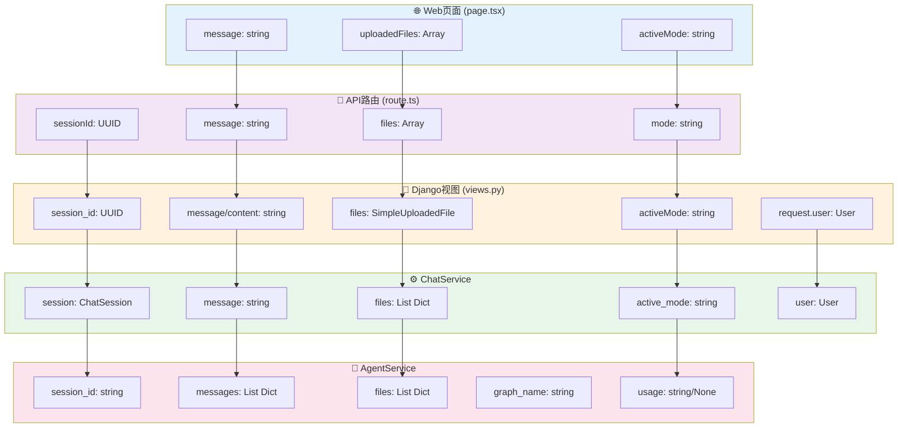
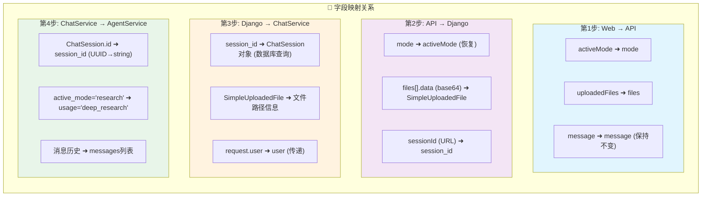
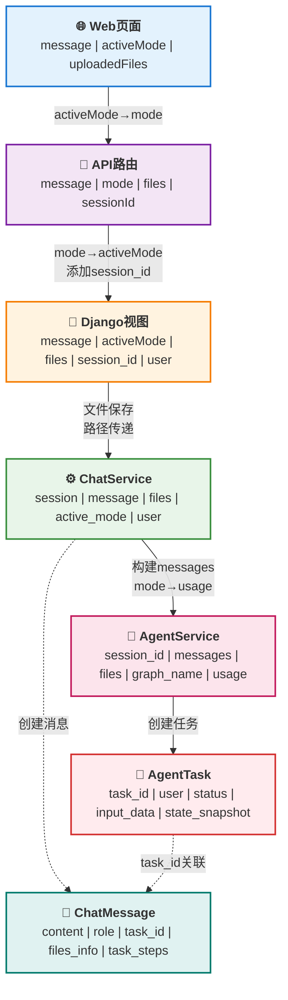
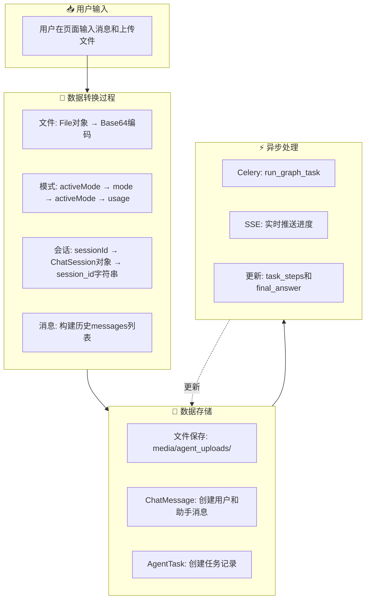
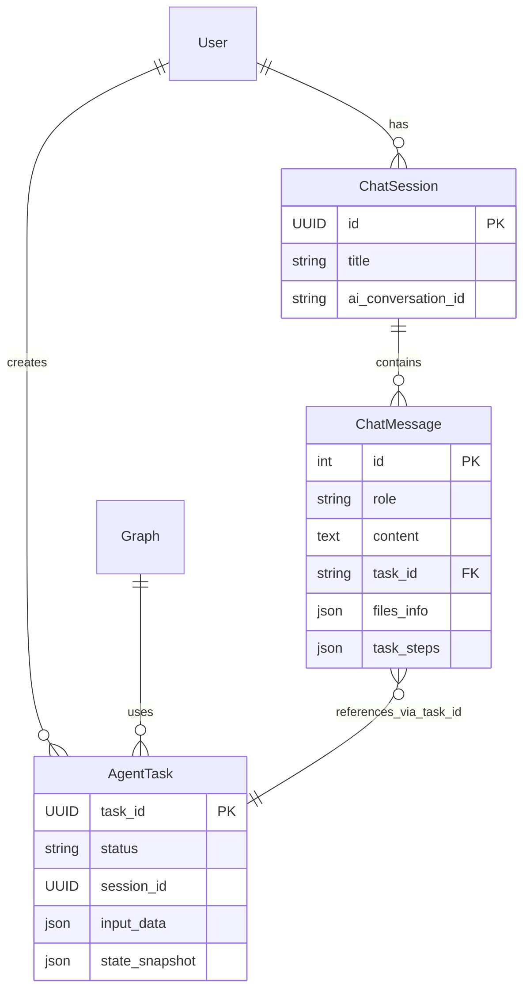

# Web页面到Agent数据的字段映射关系图

## 数据流转的属性级映射

### 方案1: 使用flowchart子图和明确连线



### 方案2: 使用表达式风格的映射图



### 方案3: 使用简化的垂直流程图



### 方案4: 数据转换流程图



## 详细字段映射表（非表格形式）

### 🔹 前端到API的映射
```
前端页面 (page.tsx)          →    API路由 (route.ts)
├─ message: string           →    message: string
├─ activeMode: string        →    mode: string ⚠️ 字段重命名
└─ uploadedFiles: Array      →    files: Array
   ├─ name: string           →    ├─ name: string
   ├─ type: string           →    ├─ type: string
   ├─ size: number           →    ├─ size: number
   └─ data: base64           →    └─ data: base64
                                  + sessionId: UUID (从URL获取)
```

### 🔹 API到Django的映射
```
API路由 (route.ts)           →    Django视图 (views.py)
├─ message: string           →    message/content: string ⚠️ 兼容两个字段名
├─ mode: string              →    activeMode: string ⚠️ 字段恢复
├─ files: Array              →    files: SimpleUploadedFile ⚠️ Base64解码
└─ sessionId: UUID           →    session_id: UUID
                                  + request.user: User (从认证获取)
```

### 🔹 Django到ChatService的映射
```
Django视图                    →    ChatService
├─ session_id                →    session: ChatSession ⚠️ 数据库查询
├─ message: string           →    message: string
├─ 文件保存结果              →    files: List[Dict]
│                                 ├─ path: 服务器路径
│                                 ├─ name: 文件名
│                                 ├─ size: 大小
│                                 └─ type: MIME类型
├─ activeMode: string        →    active_mode: string
└─ request.user              →    user: User
```

### 🔹 ChatService到AgentService的映射
```
ChatService                  →    AgentService
├─ session.id                →    session_id: str(UUID) ⚠️ 类型转换
├─ 历史消息查询              →    messages: List[Dict]
│                                 ├─ role: 'user'/'assistant'
│                                 └─ content: string
├─ files                     →    files: List[Dict]
├─ 硬编码                    →    graph_name: 'Super-Router Agent'
└─ active_mode               →    usage: 'deep_research'/None ⚠️ 值转换
   └─ 'research'             →    'deep_research'
   └─ 其他                   →    None
```

## 关键转换点说明

### 🔴 文件处理链路
```
1. 用户选择文件 (File对象)
   ↓
2. 前端转Base64编码
   ↓
3. 后端解码为SimpleUploadedFile
   ↓
4. 保存到 media/agent_uploads/
   ↓
5. Agent预处理
   - docx → markdown
   - excel → 结构化数据
   - pdf → 文本
   - 图片 → 描述文字
```

### 🔵 模式(Mode)转换链
```
activeMode (前端)
   ↓ [重命名]
mode (API路由)
   ↓ [恢复名称]
activeMode (Django)
   ↓ [传递]
active_mode (ChatService)
   ↓ [值映射]
usage (AgentService)
- 'research' → 'deep_research'
- 其他 → None
```

### 🟢 会话ID流转
```
sessionId (URL参数)
   ↓ [数据库查询]
ChatSession对象
   ↓ [提取ID]
session.id (UUID)
   ↓ [转字符串]
session_id (string)
```

## 数据模型关系

