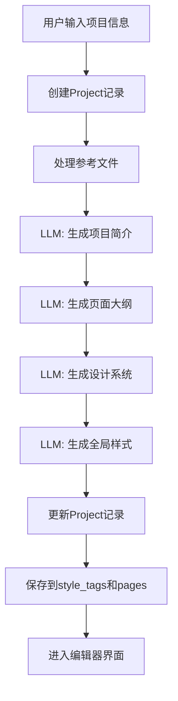
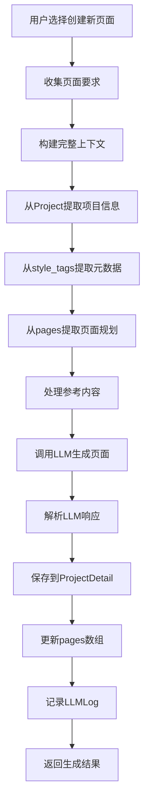
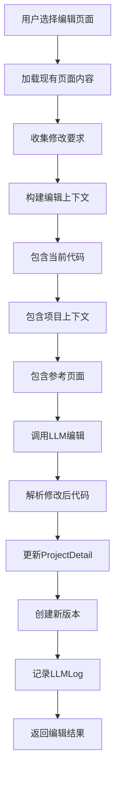

# PAGTIVE 数据流转与生产流程规范
*创建日期: 2025-09-10*

## 一、概述

本文档定义了 Pagtive 演示文稿生成系统的理想数据流转过程，包括：
- 数据库表结构及其应包含的内容
- 用户输入数据的收集和存储
- LLM 生成数据的时机和内容
- 构建提示词所需的数据来源
- 完整的数据生产和使用流程

## 二、数据库表结构与内容规范

### 2.1 Project 表（webapps_pagtive_projects）

**现有字段结构：**
```python
# ✅ 现有字段（models.py 中已定义）
{
  "id": "uuid-string",                    # ✅ 现有
  "user_id": 1,                           # ✅ 现有
  "project_name": "企业年度报告",           # ✅ 现有
  "project_description": "描述文本",        # ✅ 现有
  "project_style": "风格描述文本",          # ✅ 现有
  "global_style_code": "/* CSS代码 */",    # ✅ 现有
  "pages": [...],                          # ✅ 现有 (JSONField)
  "is_public": false,                      # ✅ 现有
  "style_tags": [...],                     # ✅ 现有 (ArrayField of JSONField)
  "reference_files": [...],                # ✅ 现有 (JSONField)
  "batch_id": null,                        # ✅ 现有
  "batch_index": null,                     # ✅ 现有
  "is_featured": false,                    # ✅ 现有
  "is_published": false,                   # ✅ 现有
  "created_at": "2025-09-10T10:00:00Z",   # ✅ 现有
  "updated_at": "2025-09-10T10:00:00Z"    # ✅ 现有
}
```

**pages 字段的当前结构 vs 理想结构：**
```json
{
  "pages": [
    {
      // ✅ 现有的字段（当前已在使用）
      "id": "page-1",
      "title": "封面页",
      "description": "展示公司Logo和年度报告标题",
      "order": 100,
      
      // ❌ 需要新增的字段（当前缺失，应在规划阶段生成）
      "content_brief": "突出展示公司品牌形象...",     // 🆕 需要新增
      "key_elements": ["Logo", "标题", "年份"],      // 🆕 需要新增
      "style_notes": "采用渐变背景，大字体标题",       // 🆕 需要新增
      "content_structure": {                        // 🆕 需要新增
        "layout": "centered-hero",
        "sections": [...]
      },
      "data_requirements": {                        // 🆕 需要新增
        "company_name": "从项目描述提取",
        "report_year": "2024"
      },
      "interaction_hints": ["淡入动画"],             // 🆕 需要新增
      "metadata": {                                // 🆕 需要新增
        "keywords": ["年度报告", "2024"],
        "target_section": "opening",
        "estimated_duration": "15s",
        "priority": "high"
      }
    }
  ]
}
```

**style_tags 字段的当前使用 vs 理想使用：**
```json
// ⚠️ 当前 style_tags 的实际使用：简单的标签数组
"style_tags": [
  {"name": "科技感", "weight": 0.8},     // ✅ 现有格式
  {"name": "商务", "weight": 0.6},       // ✅ 现有格式  
  {"name": "简约", "weight": 0.7}        // ✅ 现有格式
]

// 🔄 理想的 style_tags 使用：扩展为存储项目元数据
// 注意：需要改变使用方式，但不改变字段类型（仍是 ArrayField of JSONField）
"style_tags": [
  {
    "category": "overall_style",         // 🆕 新的结构
    "tags": {
      "content_type": "presentation",    // 🆕 需要存储（前端收集但未保存）
      "visual_style": "modern-tech",     // 🆕 需要AI生成
      "color_scheme": "blue-dominant",   // 🆕 需要AI生成
      "typography": "sans-serif-clean",  // 🆕 需要AI生成
      "animation_level": "subtle"        // 🆕 需要AI生成
    }
  },
  {
    "category": "project_metadata",      // 🆕 新的结构
    "tags": {
      "target_audience": "股东、投资者",   // 🆕 需要存储（前端收集但未保存）
      "presentation_context": "股东大会",  // 🆕 需要AI生成
      "expected_duration": "15-20分钟",   // 🆕 需要AI生成
      "key_messages": ["增长", "战略"]    // 🆕 需要AI生成
    }
  },
  {
    "category": "design_system",         // 🆕 新的结构
    "tags": {
      "primary_colors": ["#003366"],     // 🆕 需要AI生成
      "accent_colors": ["#00CCFF"],      // 🆕 需要AI生成
      "font_stack": ["Inter"],           // 🆕 需要AI生成
      "spacing_scale": [4, 8, 16],       // 🆕 需要AI生成
      "component_library": ["charts"]     // 🆕 需要AI生成
    }
  },
  {
    "category": "content_strategy",      // 🆕 新的结构
    "tags": {
      "narrative_flow": "问题-方案-成果",  // 🆕 需要AI生成
      "data_preference": "图表优先",      // 🆕 需要AI生成
      "content_density": "medium",       // 🆕 需要AI生成
      "language_tone": "professional"    // 🆕 需要AI生成
    }
  }
]
```

**reference_files 字段的当前使用 vs 理想使用：**
```json
// ⚠️ 当前 reference_files 的实际使用：只存储文件路径
"reference_files": [
  {
    "file_name": "report.pdf",           // ✅ 现有
    "file_path": "oss://path/to/file"    // ✅ 现有
  }
]

// 🔄 理想的 reference_files 使用：包含处理后的内容
"reference_files": [
  {
    "file_name": "report.pdf",           // ✅ 现有
    "file_path": "oss://path/to/file",   // ✅ 现有
    "file_type": "pdf",                  // 🆕 需要新增
    "extracted_content": "文本内容...",   // 🆕 需要新增（文件处理后的内容）
    "metadata": {                        // 🆕 需要新增
      "pages": 20,
      "size": "2.5MB",
      "upload_time": "2025-09-10T10:00:00Z",
      "key_points": ["要点1", "要点2"]    // 🆕 AI提取的关键信息
    }
  }
]
```

### 2.2 ProjectDetail 表（webapps_pagtive_project_details）

**现有字段（全部都是已存在的）：**
```json
{
  "project_id": "uuid-string",           // ✅ 现有 (ForeignKey)
  "page_id": 1,                          // ✅ 现有 (IntegerField)
  "script": "// JavaScript代码",          // ✅ 现有 (TextField)
  "styles": "/* CSS样式代码 */",          // ✅ 现有 (TextField)
  "html": "<!-- HTML内容 -->",           // ✅ 现有 (TextField)
  "images": [                            // ✅ 现有 (JSONField)
    {
      "id": "img-1",                     // ✅ 现有结构
      "url": "https://example.com/image.jpg",  // ✅ 现有结构
      "alt": "图片描述",                  // ✅ 现有结构
      "usage": "background"               // ✅ 现有结构
    }
  ],
  "mermaid_content": "graph TD\n  A-->B", // ✅ 现有 (TextField)
  "version_id": "uuid-for-version",      // ✅ 现有 (UUIDField)
  "created_at": "2025-09-10T10:00:00Z",  // ✅ 现有 (DateTimeField)
  "updated_at": "2025-09-10T10:00:00Z"   // ✅ 现有 (DateTimeField)
}
```
**注：此表字段完整，无需新增**

### 2.3 ProjectLLMLog 表（webapps_pagtive_llmlog）

**现有字段（全部都是已存在的）：**
```json
{
  "id": "uuid-string",                       // ✅ 现有 (UUIDField)
  "user_id": 1,                              // ✅ 现有 (ForeignKey)
  "project_id": "project-uuid",              // ✅ 现有 (ForeignKey)
  "page_id": 1,                              // ✅ 现有 (IntegerField)
  "provider": "openai",                      // ✅ 现有 (CharField)
  "model": "gpt-4",                          // ✅ 现有 (CharField)
  "scenario": "generate_page",               // ✅ 现有 (CharField)
  "request_timestamp": "2025-09-10T10:00:00Z", // ✅ 现有 (DateTimeField)
  "request_prompts": [...],                  // ✅ 现有 (JSONField)
  "request_config": {...},                   // ✅ 现有 (JSONField)
  "response_timestamp": "2025-09-10T10:00:05Z", // ✅ 现有 (DateTimeField)
  "response_content": "生成的内容...",         // ✅ 现有 (TextField)
  "response_error": null,                    // ✅ 现有 (TextField)
  "usage_prompt_tokens": 1500,               // ✅ 现有 (IntegerField)
  "usage_completion_tokens": 2500,           // ✅ 现有 (IntegerField)
  "usage_total_tokens": 4000,                // ✅ 现有 (IntegerField)
  "duration_ms": 5000,                       // ✅ 现有 (IntegerField)
  "status": "success",                       // ✅ 现有 (CharField)
  "temporary_page_id": "temp-page-123",      // ✅ 现有 (CharField)
  "version_id": "version-uuid"               // ✅ 现有 (UUIDField)
}
```

**scenario 字段的理想使用值：**
```json
// ⚠️ 当前可能只使用了部分值
"scenario": "generate_page"   // ✅ 现有值

// 🔄 理想情况下应支持的所有场景值
"scenario": "generate_page"    // ✅ 生成页面
"scenario": "edit_page"        // ✅ 编辑页面  
"scenario": "planning"         // 🆕 项目规划（生成大纲）
"scenario": "outline"          // 🆕 生成页面大纲
"scenario": "design_system"    // 🆕 生成设计系统
"scenario": "extract_content"  // 🆕 提取参考文件内容
"scenario": "generate_brief"   // 🆕 生成项目简介
```
**注：此表字段完整，无需新增字段，但需要扩展 scenario 的使用范围**

## 三、用户输入数据流

### 3.1 项目创建阶段（/projects/new）

**用户输入：**
```json
{
  "project_name": "企业年度报告",              // ✅ 前端收集
  "project_description": "2024年度公司业绩总结与展望", // ✅ 前端收集
  "content_type": "presentation",            // ⚠️ 前端收集但未保存
  "target_audience": "公司股东、投资者、高级管理层", // ⚠️ 前端收集但未保存
  "style_preference": "现代科技风格",           // ✅ 前端收集
  "color_preference": "蓝色系",               // ✅ 前端收集
  "reference_files": ["file1.pdf", "file2.docx"], // ✅ 前端收集
  "additional_requirements": "需要包含数据图表和时间线" // ⚠️ 前端收集但未充分利用
}
```

**当前保存情况 vs 理想保存：**
```json
// ⚠️ 当前实际保存
{
  "project_name": "企业年度报告",        // ✅ 已保存
  "project_description": "2024年度...",  // ✅ 已保存
  "project_style": "现代科技风格，蓝色系",  // ✅ 已保存（合并了style和color）
  "reference_files": [...]              // ✅ 已保存（但未处理内容）
  // ❌ content_type 丢失
  // ❌ target_audience 丢失
  // ❌ additional_requirements 丢失
}

// 🔄 理想保存方式
{
  "project_name": "企业年度报告",        // ✅ 保存到 project_name
  "project_description": "2024年度...",  // ✅ 保存到 project_description
  "project_style": "现代科技风格，蓝色系，需要包含数据图表和时间线", // ✅ 合并所有风格要求
  "style_tags": [
    {
      "category": "project_metadata",
      "tags": {
        "content_type": "presentation",     // 🆕 保存 content_type
        "target_audience": "股东、投资者",    // 🆕 保存 target_audience
        "additional_requirements": "数据图表和时间线" // 🆕 保存额外要求
      }
    }
  ],
  "reference_files": [
    {
      "file_name": "file1.pdf",
      "file_path": "oss://...",
      "extracted_content": "..."  // 🆕 需要处理并保存内容
    }
  ]
}

### 3.2 规划阶段（/projects/[id]/planning）

**系统自动触发 LLM 生成：**

1. **生成项目大纲（Outline Generation）**
   - 输入：用户提供的所有项目信息
   - 输出：完整的页面结构和内容规划

2. **生成设计系统（Design System）**
   - 输入：风格偏好、颜色偏好、目标受众
   - 输出：颜色方案、字体系统、组件库定义

3. **处理参考文件（Reference Processing）**
   - 输入：上传的文件
   - 输出：提取的文本内容、关键信息、可复用素材

## 四、LLM 数据生成流程

### 4.1 规划阶段需要 LLM 生成的数据

```javascript
// 步骤1：生成项目简介和策略
const projectBriefPrompt = {
  role: "system",
  content: "你是一个专业的演示文稿规划师..."
};

const projectBriefRequest = {
  project_name,
  project_description,
  content_type,
  target_audience,
  reference_content: extractedReferenceContent
};

// LLM 应返回：
const projectBrief = {
  executive_summary: "项目执行摘要",
  content_strategy: "内容策略",
  visual_guidelines: "视觉指南",
  key_messages: ["核心信息1", "核心信息2"],
  success_metrics: "成功标准"
};

// 步骤2：生成详细页面大纲
const outlinePrompt = {
  role: "system", 
  content: "基于项目简介，生成详细的页面大纲..."
};

// LLM 应返回：
const pageOutline = {
  pages: [
    {
      id: "page-1",
      title: "封面页",
      description: "项目封面展示",
      content_brief: "详细的内容规划...",
      key_elements: ["元素1", "元素2"],
      style_notes: "样式注意事项",
      data_requirements: {
        // 该页面需要的数据
      },
      estimated_complexity: "low/medium/high"
    },
    // ... 更多页面
  ],
  navigation_flow: "页面之间的导航关系",
  total_estimated_duration: "15-20分钟"
};

// 步骤3：生成设计系统
const designSystemPrompt = {
  role: "system",
  content: "基于项目风格要求，生成完整的设计系统..."
};

// LLM 应返回：
const designSystem = {
  colors: {
    primary: "#003366",
    secondary: "#0066CC",
    accent: "#00CCFF",
    neutral: ["#FFFFFF", "#F5F5F5", "#E0E0E0"],
    semantic: {
      success: "#00C851",
      warning: "#FFBB33", 
      error: "#FF4444"
    }
  },
  typography: {
    fontFamily: "Inter, 'Helvetica Neue', sans-serif",
    scale: {
      h1: "3rem",
      h2: "2.25rem",
      h3: "1.75rem",
      body: "1rem",
      small: "0.875rem"
    }
  },
  spacing: {
    unit: 8,
    scale: [0.5, 1, 1.5, 2, 3, 4, 6, 8, 12, 16]
  },
  components: {
    button: {
      borderRadius: "8px",
      padding: "12px 24px"
    },
    card: {
      borderRadius: "12px",
      shadow: "0 4px 6px rgba(0,0,0,0.1)"
    }
  },
  animations: {
    duration: "300ms",
    easing: "cubic-bezier(0.4, 0, 0.2, 1)"
  }
};

// 步骤4：生成全局样式代码
const globalStylePrompt = {
  role: "system",
  content: "基于设计系统，生成全局CSS变量和基础样式..."
};

// LLM 应返回：
const globalStyleCode = `
:root {
  --color-primary: #003366;
  --color-secondary: #0066CC;
  --font-family-base: Inter, 'Helvetica Neue', sans-serif;
  --spacing-unit: 8px;
  /* ... 更多CSS变量 */
}

.container {
  max-width: 1200px;
  margin: 0 auto;
  padding: var(--spacing-unit);
}

/* ... 更多全局样式 */
`;
```

### 4.2 页面生成阶段需要的数据

```javascript
// 构建页面生成提示词时需要的完整上下文
const pageGenerationContext = {
  // 项目级别信息
  project: {
    name: project.project_name,
    description: project.project_description,
    style: project.project_style,
    global_style_code: project.global_style_code
  },
  
  // 从 style_tags 中提取的元数据
  metadata: {
    content_type: extractFromStyleTags('content_type'),
    target_audience: extractFromStyleTags('target_audience'),
    design_system: extractFromStyleTags('design_system'),
    content_strategy: extractFromStyleTags('content_strategy')
  },
  
  // 当前页面信息（从 pages 数组中获取）
  currentPage: {
    title: page.title,
    description: page.description,
    content_brief: page.content_brief,
    key_elements: page.key_elements,
    style_notes: page.style_notes,
    data_requirements: page.data_requirements
  },
  
  // 参考内容
  references: {
    other_pages: otherPagesContent,  // 其他页面的内容
    uploaded_files: processedReferenceContent,  // 处理后的参考文件内容
    selected_reference: selectedReferencePage  // 用户选择的参考页面
  },
  
  // 用户的具体要求
  user_requirement: "创建一个展示公司年度业绩的数据可视化页面"
};
```

## 五、完整的数据生产流程

### 5.1 项目创建和规划流程



### 5.2 页面生成流程



### 5.3 页面编辑流程



## 六、数据使用场景

### 6.1 提示词构建数据来源

| 数据项 | 来源表 | 字段路径 | 当前状态 | 使用场景 |
|--------|--------|----------|----------|----------|
| 项目名称 | Project | project_name | ✅ 已有 | 所有生成场景 |
| 项目描述 | Project | project_description | ✅ 已有 | 所有生成场景 |
| 项目风格 | Project | project_style | ✅ 已有 | 所有生成场景 |
| 全局样式 | Project | global_style_code | ✅ 已有 | 页面生成/编辑 |
| 目标受众 | Project | style_tags→project_metadata→target_audience | 🆕 需新增 | 规划/生成 |
| 内容类型 | Project | style_tags→project_metadata→content_type | 🆕 需新增 | 规划/生成 |
| 设计系统 | Project | style_tags→design_system | 🆕 需新增 | 页面生成/编辑 |
| 页面大纲 | Project | pages→[page]→content_brief | 🆕 需新增 | 页面生成 |
| 关键元素 | Project | pages→[page]→key_elements | 🆕 需新增 | 页面生成 |
| 参考文件内容 | Project | reference_files→extracted_content | 🆕 需新增 | 规划/生成 |
| 当前HTML | ProjectDetail | html | ✅ 已有 | 页面编辑 |
| 当前CSS | ProjectDetail | styles | ✅ 已有 | 页面编辑 |
| 当前JS | ProjectDetail | script | ✅ 已有 | 页面编辑 |

### 6.2 前端需要展示的数据

```javascript
// 项目列表页
const projectList = {
  projects: [
    {
      id: project.id,
      name: project.project_name,
      description: project.project_description,
      thumbnail: generateThumbnail(project.pages[0]),  // 第一页作为缩略图
      pageCount: project.pages.length,
      lastModified: project.updated_at,
      isPublished: project.is_published
    }
  ]
};

// 编辑器页面
const editorData = {
  project: {
    id: project.id,
    name: project.project_name,
    style: project.project_style,
    globalStyles: project.global_style_code
  },
  pages: project.pages.map(page => ({
    id: page.id,
    title: page.title,
    description: page.description,
    order: page.order,
    hasContent: checkProjectDetailExists(project.id, page.id)
  })),
  currentPage: {
    ...selectedPage,
    html: projectDetail.html,
    css: projectDetail.styles,
    js: projectDetail.script
  },
  metadata: extractMetadataFromStyleTags(project.style_tags)
};
```

## 七、数据质量保证

### 7.1 必须生成的数据

在项目规划阶段，以下数据必须由 LLM 生成并保存：

1. **项目级别**
   - content_strategy（内容策略）
   - design_system（设计系统）
   - global_style_code（全局样式代码）

2. **页面级别**（每个页面都需要）
   - content_brief（内容简介）
   - key_elements（关键元素）
   - style_notes（样式说明）

3. **参考文件处理**
   - extracted_content（提取的内容）
   - 内容摘要和关键信息

### 7.2 数据完整性检查

```javascript
function validateProjectData(project) {
  const required = [
    'project_name',
    'project_description', 
    'project_style',
    'global_style_code',
    'pages'
  ];
  
  // 检查必填字段
  for (const field of required) {
    if (!project[field]) {
      throw new Error(`Missing required field: ${field}`);
    }
  }
  
  // 检查pages数组
  if (!Array.isArray(project.pages) || project.pages.length === 0) {
    throw new Error('Project must have at least one page');
  }
  
  // 检查每个页面的完整性
  project.pages.forEach((page, index) => {
    const pageRequired = ['id', 'title', 'description', 'content_brief', 'key_elements'];
    for (const field of pageRequired) {
      if (!page[field]) {
        throw new Error(`Page ${index} missing required field: ${field}`);
      }
    }
  });
  
  // 检查style_tags中的元数据
  const metadataCategories = ['project_metadata', 'design_system', 'content_strategy'];
  const styleTags = project.style_tags || [];
  
  for (const category of metadataCategories) {
    const found = styleTags.find(tag => tag.category === category);
    if (!found) {
      console.warn(`Missing metadata category: ${category}`);
    }
  }
  
  return true;
}
```

## 八、实施建议

### 8.1 短期改进（不改变数据结构）

1. **充分利用现有 JSON 字段**
   - ✅ 在 `pages` 数组中完整存储页面规划信息（增加 content_brief、key_elements 等）
   - ✅ 在 `style_tags` 中存储所有项目元数据（改变结构，存储 content_type、target_audience 等）
   - ✅ 在 `reference_files` 中存储处理后的内容（增加 extracted_content 字段）

2. **完善规划阶段**
   - 🆕 实现完整的项目规划流程
   - 🆕 调用 LLM 生成所有必要的元数据
   - 🆕 保存生成的内容到相应字段

3. **优化提示词构建**
   - 🔄 从多个字段组装完整上下文
   - 🔄 确保所有相关信息都传递给 LLM
   - ✅ 使用结构化的数据格式

### 8.2 长期优化建议

1. **考虑添加专门的元数据表**
   - 创建 ProjectMetadata 表存储扩展信息
   - 避免过度依赖 JSON 字段

2. **实现版本控制**
   - 利用 version_id 实现页面版本管理
   - 支持回滚和历史查看

3. **优化参考文件处理**
   - 实现异步文件处理队列
   - 支持更多文件格式
   - 智能提取和索引内容

## 九、实施优先级

### 9.1 立即可做（无需改代码结构）
1. ✅ **保存前端已收集的数据**
   - 将 `content_type` 和 `target_audience` 保存到 `style_tags`
   - 将 `additional_requirements` 合并到 `project_style`

### 9.2 短期必做（关键改进）
1. 🆕 **规划阶段生成完整大纲**
   - 为每个页面生成 `content_brief`、`key_elements`、`style_notes`
   - 生成项目级别的设计系统和内容策略

2. 🆕 **处理参考文件内容**
   - 提取文本内容到 `extracted_content`
   - 生成关键信息摘要

3. 🆕 **优化提示词构建**
   - 从所有相关字段提取数据
   - 组装完整的上下文

### 9.3 中期优化
1. 🔄 扩展 LLMLog 的 scenario 使用
2. 🔄 实现版本控制机制
3. 🔄 优化文件处理流程

## 十、总结

### 现状问题
- ❌ 前端收集的数据（content_type、target_audience）未保存
- ❌ 规划阶段未生成必要的元数据（页面大纲、设计系统）
- ❌ 参考文件上传但内容未提取和利用
- ❌ 生成页面时缺少上下文信息

### 改进方案
通过充分利用现有的 JSON 字段（`pages`、`style_tags`、`reference_files`），可以在**不改变数据库结构**的情况下实现完整的数据流转：

1. **Project.pages** - 扩展每个页面对象，增加 content_brief、key_elements 等字段
2. **Project.style_tags** - 改变使用方式，从简单标签改为结构化元数据存储
3. **Project.reference_files** - 增加 extracted_content 存储处理后的内容

这样可以显著提升页面生成质量，让 AI 有充分的上下文信息来生成高质量内容。