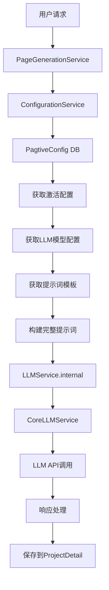

# Pagtive 模块技术手册

**最后更新**: 2025-09-02  
**项目状态**: 生产可用，持续优化中

## 模块概述

Pagtive 是一个 AI 驱动的页面生成和项目管理应用，从原 Next.js 项目迁移到 Django 后端的统一架构中。该模块支持通过自然语言描述生成完整的网页项目，包括多个页面的 HTML、CSS 和 JavaScript 代码。

### 核心功能
- **项目管理**：创建、编辑、删除和分享项目
- **AI 页面生成**：通过自然语言生成页面代码
- **页面编辑**：AI 辅助编辑现有页面
- **项目大纲生成**：自动生成项目页面结构
- **公开分享**：支持项目公开和分享功能

### 核心价值
- **效率提升**: 传统演示文稿制作从小时级别缩短到分钟级别
- **专业品质**: AI 生成的内容具备专业设计水准
- **易用性**: 无需设计技能，简单描述即可生成内容
- **协作分享**: 便捷的分享机制和公开展示

## 系统架构

### 整体架构图
```
┌─────────────────────────────────────────────────────────┐
│                     前端 (Next.js)                       │
│  /web/src/app/pagtive/*                                 │
└────────────────────┬────────────────────────────────────┘
                     │ HTTP API
                     ↓
┌─────────────────────────────────────────────────────────┐
│                  API 代理层 (Next.js)                    │
│  /web/src/app/api/pagtive/*                             │
│  使用 proxyToBackend 转发请求                            │
└────────────────────┬────────────────────────────────────┘
                     │ 
                     ↓
┌─────────────────────────────────────────────────────────┐
│                   Django 后端                            │
│  /backend/webapps/pagtive/                              │
├─────────────────────────────────────────────────────────┤
│  Views (视图层)                                          │
│  ├── ProjectViewSet     - 项目 CRUD                     │
│  ├── GenerateViewSet    - AI 生成功能                   │
│  └── ShareViewSet       - 分享功能                      │
├─────────────────────────────────────────────────────────┤
│  Services (服务层)                                       │
│  ├── ProjectService         - 项目业务逻辑              │
│  ├── PageGenerationService  - AI 页面生成               │
│  ├── ConfigurationService   - 配置管理                  │
│  └── StorageService         - 文件存储                  │
├─────────────────────────────────────────────────────────┤
│  Models (数据层)                                         │
│  ├── Project        - 项目主表                          │
│  ├── ProjectDetail  - 页面详情                          │
│  ├── ProjectLLMLog  - LLM 调用日志                      │
│  └── PagtiveConfig  - 配置表                            │
└─────────────────────────────────────────────────────────┘
                     │
                     ↓
┌─────────────────────────────────────────────────────────┐
│              外部服务和存储                              │
│  ├── PostgreSQL    - 主数据库                           │
│  ├── LLM Service   - AI 模型服务                        │
│  └── OSS           - 对象存储服务                       │
└─────────────────────────────────────────────────────────┘
```

### 服务层架构

项目采用服务层架构模式，将业务逻辑从视图层分离：

#### 1. ProjectService - 项目管理服务
```python
from webapps.pagtive.services import ProjectService
service = ProjectService()

# 创建项目（支持自动生成大纲）
project = service.create_project(
    user=user,
    project_name="我的网站",
    generate_outline=True
)
# 管理页面列表
page = service.add_page_to_project(project, "页面标题")
```

#### 2. PageGenerationService - AI 页面生成服务
```python
from webapps.pagtive.services import PageGenerationService
service = PageGenerationService()

# 生成页面内容
result = service.generate_page_content(
    project=project,
    user=user,
    prompt="创建产品展示页面"
)
# 编辑现有页面
result = service.edit_page_content(
    project=project,
    page_id=1,
    edit_prompt="修改背景色"
)
```

#### 3. ConfigurationService - 配置管理服务
- 管理 LLM 配置（模型选择、参数设置）
- 缓存配置（5分钟TTL）
- 提供默认配置和提示词模板

#### 4. StorageService - 存储服务
- 文件上传到 OSS
- 管理文件路径和访问URL
- 支持批量操作

### LLM 调用链架构



### 页面数据关联机制

`Project.pages`（JSON字段）与 `ProjectDetail`（表记录）的双向关联：
- **pages字段**: 存储页面元信息 `[{"id": "1", "title": "首页", "order": 100}]`
- **ProjectDetail**: 存储页面实际内容（HTML/CSS/JS）
- **关联键**: `page_id` 连接两者
- **自动同步**: 生成新页面时自动更新 `project.pages`

## 数据模型

### Project（项目表）
```python
- id: UUID 主键
- user: 用户关联
- project_name: 项目名称
- project_description: 项目描述
- project_style: 项目风格
- global_style_code: 全局样式
- pages: JSONField 页面列表
- is_public: 是否公开
- is_published: 是否发布
- created_at: 创建时间
- updated_at: 更新时间
```

### ProjectDetail（页面详情表）
```python
- project: 项目关联
- page_id: 页面ID
- html: HTML内容
- styles: CSS样式
- script: JavaScript脚本
- mermaid_content: Mermaid图表
- images: 图片列表
- version_id: 版本号
```

### ProjectLLMLog（LLM调用日志表）
```python
- project: 项目关联
- page_id: 页面ID
- scenario: 场景类型
- prompt: 用户提示
- llm_request: 请求内容
- llm_response: 响应内容
- status: 处理状态
- request_timestamp: 请求时间
- response_timestamp: 响应时间
```

### PagtiveConfig（配置表）
```python
- name: 配置名称
- llm_config: LLM配置
- prompt_templates: 提示词模板
- is_active: 是否激活
```

## API 接口规范

### 项目管理接口

| 接口 | 方法 | 路径 | 说明 |
|------|------|------|------|
| 项目列表 | GET | `/api/pagtive/projects` | 获取用户的所有项目 |
| 创建项目 | POST | `/api/pagtive/projects` | 创建新项目 |
| 项目详情 | GET | `/api/pagtive/projects/{id}` | 获取项目详细信息 |
| 更新项目 | PUT/PATCH | `/api/pagtive/projects/{id}` | 更新项目信息 |
| 删除项目 | DELETE | `/api/pagtive/projects/{id}` | 删除项目 |

### 页面管理接口

| 接口 | 方法 | 路径 | 说明 |
|------|------|------|------|
| 页面列表 | GET | `/api/pagtive/projects/{id}/pages` | 获取项目的所有页面 |
| 创建页面 | POST | `/api/pagtive/projects/{id}/pages` | 创建新页面 |
| 页面详情 | GET | `/api/pagtive/projects/{id}/pages/{pageId}` | 获取页面详情 |
| 更新页面 | PUT | `/api/pagtive/projects/{id}/pages/{pageId}` | 更新页面内容 |
| 删除页面 | DELETE | `/api/pagtive/projects/{id}/pages/{pageId}` | 删除页面 |

### AI 生成接口

| 接口 | 方法 | 路径 | 说明 |
|------|------|------|------|
| 生成内容 | POST | `/api/pagtive/generate` | 生成或编辑页面内容 |
| 生成大纲 | POST | `/api/pagtive/projects/{id}/generate-outline` | 生成项目大纲 |

### 分享接口

| 接口 | 方法 | 路径 | 说明 |
|------|------|------|------|
| 获取分享 | GET | `/api/pagtive/share/{id}` | 获取公开项目（无需认证） |

## 核心流程

### 项目创建流程

1. **用户提交项目信息**
   ```json
   {
     "project_name": "企业官网",
     "project_description": "公司介绍网站",
     "project_style": "现代简约",
     "generate_outline": true
   }
   ```

2. **后端处理流程**
   - ProjectService.create_project() 创建项目实例
   - 如果 generate_outline=true，调用 PageGenerationService.generate_project_outline()
   - LLM 生成页面列表结构
   - 为每个页面创建 ProjectDetail 记录
   - 返回完整的项目信息

3. **数据存储**
   - Project 表存储项目元数据
   - pages 字段存储页面列表结构
   - ProjectDetail 表存储每个页面的具体内容

### AI 页面生成/编辑流程

1. **生成新页面**
   ```json
   {
     "projectId": "xxx",
     "prompt": "创建一个产品展示页面",
     "scenario": "generatePageCode"
   }
   ```

2. **编辑现有页面**
   ```json
   {
     "projectId": "xxx",
     "pageId": "1",
     "prompt": "添加一个联系表单",
     "scenario": "editPageCode",
     "current": {
       "html": "现有HTML",
       "styles": "现有CSS",
       "script": "现有JS"
     }
   }
   ```

3. **处理流程**
   - PageGenerationService 根据 scenario 选择提示词模板
   - 调用 LLM 服务生成/修改内容
   - 保存到 ProjectDetail
   - 更新 project.pages
   - 记录 LLM 调用日志

## 开发和测试

### 启动服务

```bash
# 后端服务
cd /Users/chagee/Repos/X/backend
source .venv/bin/activate
python manage.py runserver

# 前端服务
cd /Users/chagee/Repos/X/web
pnpm dev
```

### API 测试示例

```bash
# 获取项目列表
curl -X GET http://localhost:3000/api/pagtive/projects \
  -H "Authorization: Bearer YOUR_TOKEN"

# 创建项目
curl -X POST http://localhost:3000/api/pagtive/projects \
  -H "Content-Type: application/json" \
  -H "Authorization: Bearer YOUR_TOKEN" \
  -d '{
    "project_name": "测试项目",
    "project_description": "测试描述",
    "generate_outline": true
  }'

# 生成页面内容
curl -X POST http://localhost:3000/api/pagtive/generate \
  -H "Content-Type: application/json" \
  -H "Authorization: Bearer YOUR_TOKEN" \
  -d '{
    "projectId": "xxx",
    "prompt": "创建一个登录页面",
    "scenario": "generatePageCode"
  }'
```

### 前端集成

```typescript
import { authFetch } from '@/lib/auth-fetch';

// 获取项目列表
const response = await authFetch('/api/pagtive/projects');
const projects = await response.json();

// 创建项目
const response = await authFetch('/api/pagtive/projects', {
  method: 'POST',
  body: JSON.stringify({
    project_name: '新项目',
    project_description: '项目描述'
  })
});

// 生成页面
const response = await authFetch('/api/pagtive/generate', {
  method: 'POST',
  body: JSON.stringify({
    projectId: 'xxx',
    prompt: '创建产品页面',
    scenario: 'generatePageCode'
  })
});
```

### 关键前端组件

#### 认证系统 (authFetch)
- 自动处理JWT认证头
- 401错误自动跳转登录
- 支持相对和绝对URL

#### 缓存管理 (pagtiveCache)
- 项目级内存缓存
- 数据变更时主动清除
- 减少重复API调用

#### 沙盒预览 (CodePreviewSandbox)
```typescript
<CodePreviewSandbox
  htmlContent={html}
  cssContent={css} 
  jsContent={js}
  globalStyleCode={globalCss}
  mermaidContent={mermaid}
/>
```
- iframe隔离执行环境
- 支持外部库加载
- 防止XSS攻击

## 配置管理

### LLM 配置

配置存储在 PagtiveConfig 表中，支持：
- 多模型配置（GPT-4、Claude等）
- 动态切换模型
- 自定义提示词模板
- 配置缓存（5分钟）

### 提示词模板

系统支持两种主要场景的提示词模板：
1. **生成模板** (generatePageCode) - 从零创建页面
2. **编辑模板** (editPageCode) - 修改现有页面

模板支持以下变量：
- `{description}` - 用户的描述
- `{project_style}` - 项目风格
- `{current_html}` - 现有HTML（编辑模式）
- `{current_css}` - 现有CSS（编辑模式）
- `{current_js}` - 现有JS（编辑模式）

## 安全性考虑

1. **认证授权**
   - 除分享接口外，所有接口需要 JWT 认证
   - 用户只能访问自己的项目
   - 公开项目通过 is_public 标志控制

2. **XSS 防护**
   - 前端使用 iframe sandbox 隔离生成的内容
   - 限制 iframe 权限，防止恶意脚本

3. **数据验证**
   - 使用 Django 序列化器验证输入
   - 文件上传限制类型和大小
   - SQL 注入防护通过 ORM 实现

## 性能优化

1. **缓存策略**
   - 配置服务实现 5 分钟缓存
   - 减少数据库查询

2. **批量操作**
   - 支持批量创建页面
   - 使用事务保证数据一致性

3. **异步处理**
   - LLM 调用可以改为异步任务
   - 使用 Celery 处理长时间操作

## 前端页面路由

```
/pagtive/
├── page.tsx                    # 项目列表页
├── projects/
│   ├── new/                   # 创建项目
│   └── [projectId]/
│       ├── preview/            # 项目预览
│       ├── settings/           # 项目设置（待完善）
│       └── pages/
│           ├── new/            # 新建页面
│           └── [pageId]/edit/  # 编辑页面
└── share/[shareId]/           # 公开分享
```

## 当前实施状态

### 已完成功能 ✅
- 数据模型设计和迁移
- 项目列表展示
- 项目创建和AI生成大纲
- 页面预览功能
- 基础编辑功能
- 分享机制框架
- LLM 服务集成
- 页面CRUD操作

### 开发中功能 🔄
- 页面编辑器增强
- 文件上传完善
- 项目设置页面

### 待开发功能（高优先级）⏳
- [ ] 文件上传功能完成
- [ ] 页面历史和版本管理
- [ ] 项目设置页面实现
- [ ] 发布和分享功能完善
- [ ] 项目克隆/复制功能
- [ ] 草稿自动保存

### 待开发功能（中优先级）
- [ ] 搜索和筛选功能
- [ ] 操作确认对话框
- [ ] 批量页面操作
- [ ] 项目模板功能
- [ ] 导出功能（HTML/PDF）

### 待开发功能（低优先级）
- [ ] 协作功能
- [ ] 数据分析仪表板
- [ ] 评论系统
- [ ] 实时协作
- [ ] GraphQL 支持

## 故障排查

### 常见问题

1. **认证失败**
   - 检查 JWT token 是否有效
   - 确认使用 authFetch 工具

2. **CORS 错误**
   - 检查 Django CORS 配置
   - 确认前端代理配置正确

3. **LLM 调用失败**
   - 检查 LLM 服务配置
   - 查看 ProjectLLMLog 日志

4. **页面内容不显示**
   - 检查 ProjectDetail 数据
   - 确认 iframe 权限设置

### 日志查看

```bash
# Django 日志
tail -f /Users/chagee/Repos/X/backend/logs/django.log

# 数据库查询
python manage.py dbshell
SELECT * FROM webapps_pagtive_project WHERE user_id = xxx;
SELECT * FROM webapps_pagtive_projectdetail WHERE project_id = 'xxx';
```

## 相关文档

- `backend/webapps/pagtive/services/SERVICE_HANDBOOK.md` - 服务层详细文档
- `web/src/app/pagtive/TODO-2025-09-02.md` - 待开发功能详细列表
- `docs/SYSTEM_ARCHITECTURE.md` - 系统整体架构
- `/Users/chagee/Repos/Pagtive` - 原项目参考代码

## 总结

Pagtive 模块实现了完整的 AI 驱动页面生成功能，采用服务层架构确保代码的可维护性和可扩展性。系统已经具备核心功能，可以正常提供服务。后续可以根据业务需求逐步完善和优化功能。

---
*本手册持续更新中，请关注最新版本*