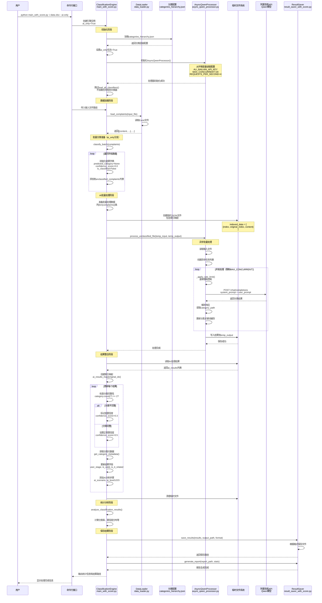
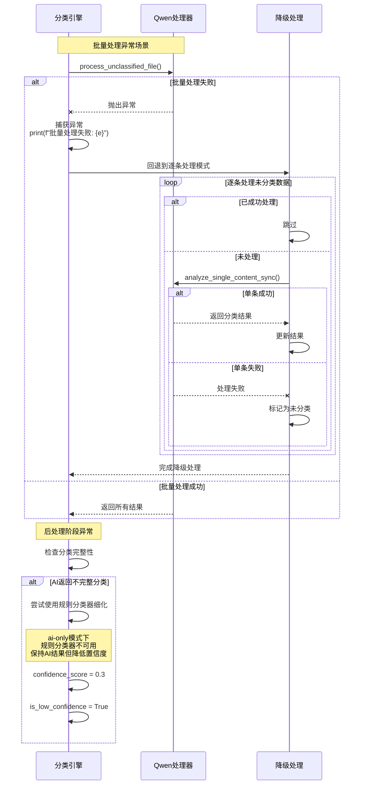

# AI-Only分类模式的完整处理流程图

## 相关业务
notebook/comment-classify/main_with_score.py
notebook/comment-classify/ai_module/async_qwen_processor.py
notebook/comment-classify/ai_module/base_ai_processor.py
notebook/comment-classify/categories_hierarchy.json
notebook/comment-classify/processors/data_loader.py
notebook/comment-classify/processors/result_saver_with_score.py

## 目的
描述使用 --ai-only 参数时，系统如何完全跳过规则分类器，仅使用AI（Qwen）进行批量分类的完整业务流程和数据流转

## 规范
- mermaid 流程
- 数据流转UML图，精确到字段，每个节点是一个关键的数据处理环节的对应函数

## 画流程图

### AI-Only模式批量分类全流程



#### 数据流转详情

```mermaid
graph TB
    subgraph 初始化数据结构
        A1[命令行参数] -->|"--ai-only=True"| A2[引擎配置]
        A2 -->|"ai_only=True"| A3[跳过规则加载]
        A3 --> A4[仅初始化Qwen处理器]
        
        A5[categories_hierarchy.json] -->|"{ 
            categories: {
                '一级分类': {
                    user_stage: string,
                    is_valid: string,
                    is_it_related: string,
                    children: [...]
                }
            }
        }"| A6[分类层级配置]
    end
    
    subgraph 输入数据处理
        B1[Excel文件] -->|"DataLoader.load_complaints()"| B2[原始数据列表]
        B2 -->|"[
            {
                content: string,
                其他字段...
            }
        ]"| B3[待分类数据]
    end
    
    subgraph AI-Only批量准备
        C1[所有输入数据] -->|"直接标记为未分类"| C2[初始化结果]
        C2 -->|"{
            predicted_category: None,
            confidence_score: 0.0,
            classifier_name: None,
            is_classified: False,
            is_low_confidence: False,
            user_stage: '',
            is_valid: '',
            is_it_related: ''
        }"| C3[results列表]
        
        C1 -->|"添加索引"| C4[unclassified_complaints]
        C4 -->|"[
            (original_index, complaint_data)
        ]"| C5[带索引的未分类列表]
    end
    
    subgraph 临时文件结构
        D1[未分类数据] -->|"创建索引映射"| D2[indexed_data]
        D2 -->|"[{
            index: int,           # 批次内索引
            original_index: int,  # 原始数据索引
            content: string       # 待分类内容
        }]"| D3[临时输入文件.json]
        
        D4[AI处理结果] -->|"保留索引信息"| D5[临时输出文件.json]
        D5 -->|"[{
            original_index: int,
            content: string,
            category_path: string,
            keywords: list,
            reason: string,
            ai_steps: {
                scenario_analysis: string,
                level1_candidates: list,
                level2_candidates: list,
                level3_candidates: list
            }
        }]"| D6[结果映射]
    end
    
    subgraph Qwen异步处理
        E1[批量输入] -->|"asyncio并发"| E2[任务队列]
        E2 -->|"速率限制"| E3[限流控制]
        E3 -->|"Semaphore(20)"| E4[并发数限制]
        E3 -->|"4 req/s"| E5[请求速率限制]
        
        E6[API请求] -->|"{
            model: 'qwen-plus',
            messages: [
                {role: 'system', content: prompt},
                {role: 'user', content: text}
            ],
            max_tokens: 500,
            temperature: 0.3
        }"| E7[Qwen响应]
        
        E7 -->|"解析JSON"| E8[分类结果]
    end
    
    subgraph 结果整合
        F1[AI结果映射] -->|"ai_results_map[original_idx]"| F2[按索引更新]
        F2 -->|"检查完整性"| F3{分类深度检查}
        
        F3 -->|"< 2级"| F4[不完整分类]
        F3 -->|">= 2级"| F5[完整分类]
        
        F4 -->|"confidence=0.3"| F6[低置信度标记]
        F5 -->|"confidence=0.5"| F7[正常置信度]
        
        F8[分类元数据] -->|"get_category_metadata()"| F9[元数据提取]
        F9 -->|"{
            user_stage: string,
            is_valid: string,
            is_it_related: string
        }"| F10[更新结果字段]
    end
    
    subgraph 输出数据结构
        G1[最终结果] -->|"[{
            content: string,
            predicted_category: string,
            confidence_score: float,
            classifier_name: 'Qwen分类器',
            is_classified: bool,
            is_low_confidence: bool,
            user_stage: string,
            is_valid: string,
            is_it_related: string,
            ai_scenario: string,
            ai_level1: string,
            ai_level2: string,
            ai_level3: string
        }]"| G2[结果列表]
        
        G3[统计信息] -->|"{
            total: int,
            classified: int,
            unclassified: int,
            low_confidence: int,
            classification_rate: float,
            average_confidence: float,
            category_distribution: dict,
            classifier_usage: dict,
            score_distribution: dict
        }"| G4[分析报告]
    end
```



### 异常处理与降级策略



## 关键数据结构说明

### AsyncQwenProcessor配置
```python
class AsyncQwenProcessor:
    """异步Qwen处理器配置"""
    api_key: str                    # 阿里百炼API密钥
    base_url: str                   # API基础URL
    model_name: str = 'qwen-plus'  # 使用的模型
    max_concurrent: int = 20       # 最大并发数
    requests_per_second: int = 4   # 每秒请求限制
    rate_limiter: Semaphore        # 并发控制信号量
    request_times: List[float]     # 请求时间记录
    adaptive_slowdown: float = 1.0 # 自适应减速因子
```

### 分类结果数据结构
```python
# AI处理返回的单个结果
{
    'original_index': int,           # 原始数据索引
    'content': str,                  # 原始内容
    'category_path': str,            # 分类路径 "一级/二级/三级"
    'keywords': List[str],           # 提取的关键词
    'reason': str,                   # 分类理由
    'ai_steps': {                    # AI分析步骤
        'scenario_analysis': str,    # 场景分析
        'level1_candidates': List,   # 一级分类候选
        'level2_candidates': List,   # 二级分类候选  
        'level3_candidates': List    # 三级分类候选
    }
}
```

### 最终输出结果结构
```python
# 每条数据的完整分类结果
{
    # 原始数据字段
    'content': str,                  # 投诉内容
    # ... 其他原始字段
    
    # 分类结果字段
    'predicted_category': str,       # 预测的分类路径
    'confidence_score': float,       # 置信度分数 (0.3或0.5)
    'classifier_name': str,          # "Qwen分类器"
    'is_classified': bool,           # 是否成功分类
    'is_low_confidence': bool,       # 是否低置信度
    
    # 分类元数据
    'user_stage': str,               # 用户阶段
    'is_valid': str,                 # 是否有效
    'is_it_related': str,            # 是否相关
    
    # AI分析详情
    'ai_scenario': str,              # 场景分析描述
    'ai_level1': str,                # 一级候选分类
    'ai_level2': str,                # 二级候选分类
    'ai_level3': str                 # 三级候选分类
}
```

### 统计分析结构
```python
{
    'total': int,                    # 总数据量
    'classified': int,               # 成功分类数
    'unclassified': int,            # 未分类数
    'low_confidence': int,          # 低置信度数
    'classification_rate': float,    # 分类率
    'average_confidence': float,     # 平均置信度
    'category_distribution': Dict,   # 各分类数量分布
    'classifier_usage': Dict,        # 分类器使用统计
    'score_distribution': Dict       # 置信度分布
}
```

## 性能优化策略

### 并发控制
- **最大并发数**: 20个请求同时处理
- **速率限制**: 每秒4个请求（基于Token限制）
- **自适应减速**: 遇到速率限制时自动调整请求速度

### 批量处理优势
- 一次性创建所有异步任务
- 利用asyncio事件循环高效调度
- 减少网络往返次数
- 批量更新结果，减少数据库操作

### 内存优化
- 使用临时文件存储中间结果
- 处理完成后立即清理临时文件
- 采用索引映射而非完整数据复制

## 注意事项

1. **AI-Only模式特点**
   - 完全跳过规则分类器加载和执行
   - 所有数据100%通过AI处理
   - 固定置信度：完整分类0.5，不完整0.3
   - 无法利用规则分类器进行细化

2. **适用场景**
   - 规则难以覆盖的复杂内容
   - 需要更灵活理解语义的场景
   - 初期建立分类体系时的探索阶段

3. **限制条件**
   - 依赖外部API服务可用性
   - 受API速率限制影响
   - 成本相对规则分类器更高
   - 分类一致性可能不如规则分类器